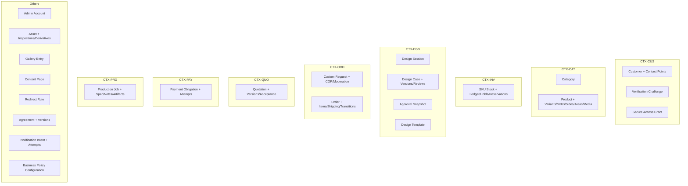

# DB2 — Aggregate Catalog

**Date:** 2026-07-15 · **Git HEAD:** `f90f78c`
**Nature:** Conceptual aggregates only — no tables, columns, keys, or Drizzle
schema. "Commands"/"events" are conceptual names, not code signatures.
Boundaries follow §8 modeling principles: consistency/invariant ownership, not
screens or CRUD.

Overview diagram (composition only; references shown in the relationship
model):

---

### AGG-01 — Admin Account (CTX-IDN)

- **Root:** Admin Account (CON-001). **Children:** Admin Credential Reference (CON-002), Admin Session (CON-003).
- **Purpose:** the single operator identity (D-018), replaceable and recoverable.
- **VOs:** —. **Snapshots:** —. **Append-only:** none owned (security actions → Audit).
- **External refs:** none. **Invariants owned:** exactly-one-active-admin (REQ-IDN-001).
- **Consistency boundary:** account + credentials + sessions change together.
- **Commands (conceptual):** rotate credential, revoke session, replace admin.
- **Events:** admin-security-changed (→ audit, notification).
- **DB3:** LC-01 (disable/lockout/recovery states undefined — DB3). **DB4:** small mutable structures; credential detail abstract until DEC-29.
- **Class:** security-sensitive. **Retention:** commercial/audit.
- **Why this boundary:** single credential/session consistency unit; excluded: customer identity (different threat model), audit records (Audit owns evidence).

### AGG-02 — Customer (CTX-CUS)

- **Root:** Customer (CON-010). **Children:** Contact Point (CON-011), Business Profile (CON-012, dormant).
- **VOs:** Email/Phone (CON-163/164), Contact Snapshot (CON-018), Masked Identifier (CON-017).
- **External refs:** none outward (others reference CustomerId).
- **Invariants owned:** one active verified link per contact point (ADR-DB2-001); one primary contact.
- **Commands:** attach verified contact, set primary, anonymize (retention), audited merge.
- **Events:** customer-verified, contact-attached, customer-anonymized.
- **DB3:** guest→verified transition guards; merge audit flow. **DB4:** PII anonymization columns per ADR-DB1-011.
- **Class:** customer-private. **Retention:** commercial + field-level anonymization.
- **Why:** contact uniqueness/dedup is one consistency unit; excluded: sessions (temporary, guest-capable), grants (own lifecycle), requests (Ordering owns the case).

### AGG-03 — Verification Challenge (CTX-CUS)

- **Root:** Verification Challenge (CON-013). **Children:** Attempt/Result (CON-014, append-only).
- **Invariants owned:** idempotent issuance; challenge binds one contact point; expiry explicit.
- **Commands:** issue, verify, expire. **Events:** contact-verified.
- **DB3:** attempt limits, cooldown, re-verification triggers (GAP-12 — not resolved here). **DB4:** transient shape.
- **Class:** security-sensitive. **Retention:** transient.
- **Why separate from Customer:** short-lived, high-frequency, races isolated from the Customer record.

### AGG-04 — Secure Access Grant (CTX-CUS)

- **Root:** Secure Access Grant (CON-015). **VOs:** Grant Scope (CON-016), token (secret; storage form → DB4/DB3 security design).
- **External refs:** CustomerId, RequestId (scope binding).
- **Invariants owned:** INV-08 (grant reaches only the owning customer/request); revocation wins over in-flight use (DB3 detail).
- **Commands:** issue, revoke, expire, re-issue. **Events:** grant-issued/revoked.
- **DB3:** expiry/revocation policy (O-005/DEC-26 — deferred, not resolved here).
- **Class:** security-sensitive. **Retention:** operational.
- **Why:** access control lifecycle independent of customer record; a grant is not identity (ADR-DB2-001).

### AGG-05 — Category (CTX-CAT)

- **Root:** Category (CON-020). **VOs:** SEO Metadata (CON-027).
- **Commands:** create/edit/reorder/archive. **Class:** public. **Retention:** commercial(archive).
- **Why separate from Product:** independent publication/SEO lifecycle; products reference CategoryId.

### AGG-06 — Product (CTX-CAT)

- **Root:** Product (CON-021). **Children:** Variant (CON-022), SKU (CON-023, definition only), Product Side (CON-024), Embroidery Area (CON-025), Product Media (CON-026 → AssetId).
- **VOs:** SEO Metadata, Physical Dimension (CON-028), Coordinate Mapping (CON-029), Money (base price).
- **External refs:** CategoryId, AssetId (media/backgrounds).
- **Invariants owned:** structural integrity of sides/areas/variants/SKUs used by the designer; publication state (LC-04); manual out-of-stock display override.
- **Commands:** create/edit/publish/unpublish/archive, configure sides/areas, manage variants/SKUs, set base price.
- **Events:** product-published/**unpublished**/archived/changed (→ audit, cache/SEO revalidation). Unpublished announces that public visibility was removed without archiving (TR-LC04-05, IMP-D035).
- **DB3:** LC-04/LC-05 display semantics. **DB4:** geometry VO shapes; price history NOT kept here — commercial history lives in quotation/order snapshots (INV-12).
- **Class:** public (+financial base price). **Retention:** archive; hard delete only never-published.
- **Why this boundary:** the designer and storefront need one consistent product-geometry unit; excluded: stock (Inventory truth), templates (Design-owned), asset binaries.

### AGG-07 — SKU Stock (CTX-INV)

- **Root:** SKU Stock (CON-030, one per SKUId reference). **Children:** Ledger Entry (CON-031, append-only), Soft Hold (CON-032), Official Reservation (CON-033).
- **Derived:** Inventory Balance (CON-034 = available/held/sold). **VOs:** Low-Stock Threshold (CON-035), Adjustment Reason (CON-036).
- **External refs:** SKUId (Catalog), OrderId/RequestId (hold/reservation subjects).
- **Invariants owned:** INV-18 non-negative (override = audited), INV-05 reservation gate inputs enforced at command level, idempotent release/consume/expire (ADR-DB1-018).
- **Commands:** adjust (reasoned), place/release soft hold, create official reservation (gated), consume, expire-sweep, audited override.
- **Events:** stock-adjusted, reservation-created/released/consumed/expired (→ audit; availability projection).
- **DB3:** LC-17 full lifecycle + insufficient-stock behavior. **DB8:** concurrency races. **DB4:** ledger/balance shapes.
- **Class:** internal. **Retention:** ledger = commercial record; holds = operational.
- **Why:** stock correctness under concurrency is exactly one consistency boundary per SKU; excluded: SKU definition (Catalog), order state.

### AGG-08 — Asset (CTX-AST)

- **Root:** Asset (CON-040). **Children:** Inspection Result (CON-041, append-only), Derivative (CON-042).
- **VOs:** Object Storage Reference (CON-043), Access Scope (CON-044).
- **Invariants owned:** INV-10 (metadata only, binary in object storage), private-by-default (INV-09), derivative watermark rule (INV-22).
- **Commands:** register upload, record inspection, produce derivative (worker, idempotent), decide deletion (two-phase tombstone per ADR-DB1-011).
- **Events:** asset-accepted/rejected, derivative-ready.
- **DB3:** LC-06 incl. quarantine/retry gaps. **DB4:** metadata + tombstone shape.
- **Class:** mixed by kind (customer upload = customer-private; template/production = production-sensitive; catalog/gallery = public derivative).
- **Why:** one validation/derivative pipeline; excluded: semantic meaning (Product Media, Gallery association, Production Artifact own their association to AssetId).

### AGG-09 — Design Session (CTX-DSN)

- **Root:** Design Session (CON-050, temporary; includes autosave working copy CON-051 + save state).
- **VOs:** Design Document payload (CON-052, opaque, `document_schema_version`).
- **External refs:** ProductId/VariantId/Side/Area, AssetIds (uploads), optional TemplateId+version (clone origin).
- **Invariants owned:** stale/concurrent autosave safety (REQ-SESS-002); session is not a library (D-006).
- **Commands:** autosave, submit (handover to request creation), expire, cleanup.
- **Events:** session-submitted, session-expired.
- **DB3:** LC-07 (TTL O-008 deferred). **DB4:** temporary storage shape.
- **Class:** customer-private. **Retention:** transient (hard delete/anonymize).
- **Why separate from Design Case:** guest-capable, disposable, high-write; formal versions must never depend on mutable session state.

### AGG-10 — Design Case (CTX-DSN)

- **Root:** Design Case (CON-053, one per request's design thread). **Children:** Design Version (CON-054, immutable snapshot once sent/approved), Review Decision (CON-055, append-only).
- **VOs:** Integrity Hash (CON-058), Embroidery Placement (CON-060), Thread Color (CON-059).
- **External refs:** RequestId, AssetId (preview derivative), parent-version self-references.
- **Invariants owned:** **INV-16 single active review version**; INV-01/17 approved immutability/terminality; version chain completeness (REQ-DVER-005, D-011).
- **Commands:** create formal version, send for review, record review decision, supersede/void unapproved, approve (creates AGG-11 transactionally).
- **Events:** version-sent, revision-requested, version-approved.
- **DB3:** LC-08/LC-09 final states; who may VOID. **DB4:** version snapshot + partial-unique handoff. **DB7/DB8:** immutability + single-active-review proofs.
- **Class:** customer-private. **Retention:** commercial record (versions never deleted).
- **Why:** the single-active-review invariant and version chain need one transactional owner; excluded: approval snapshot (own record below), session, request state.

### AGG-11 — Approval Snapshot (CTX-DSN)

- **Root:** Approval Snapshot (CON-056) — an immutable, childless record created in the approval transaction.
- **Contents (conceptual, per `06 §9`):** approved version ref, document hash, preview hash, product/variant/side/area, physical dimensions, thread colors, quantity, timestamp, customer identity reference (contact snapshot), Terms Acceptance Reference (CON-129).
- **Invariants owned:** INV-01/03 anchor — never mutated, never deleted while commercial history exists; historical approvals retained on reopen (J10).
- **Commands:** create (only). Corrections = new approval (supersede), never edit.
- **DB3:** approval guards; relation to quotation acceptance (GAP-03 — not resolved here). **DB4:** immutable structure + trigger handoff (ADR-DB1-010).
- **Class:** customer-private + financial. **Retention:** commercial record.
- **Why own aggregate:** consumed cross-context (Order, Production, Payment gate) as a snapshot; its immutability must not depend on Design Case mutability.

### AGG-12 — Design Template (CTX-DSN)

- **Root:** Design Template (CON-057). Per [`DB2_DESIGN_TEMPLATE_DECISION.md`](./DB2_DESIGN_TEMPLATE_DECISION.md): store-authored design document (design-document schema), optional product/side/area scoping, publication state, version counter; clone-on-use.
- **External refs:** optional ProductId/Side/Area, AssetIds (private originals).
- **Invariants owned:** template updates never mutate existing clones/sessions/versions.
- **Class:** internal source, public listing metadata. **Retention:** commercial(archive).

### AGG-13 — Custom Request (CTX-ORD)

- **Root:** Custom Request (CON-070). **Children:** Customer-Owned Product (CON-071), Moderation Note (CON-072, append-only).
- **VOs:** Request Code (CON-073), Quantity Breakdown (CON-074), notes.
- **External refs:** CustomerId, ProductId/VariantId (store subject) **or** embedded COP, DesignCaseId (current), QuotationId (current), AssetIds (uploads), SecureGrant scope target.
- **Invariants owned:** request state integrity (LC-11 guards → DB3); INV-13 (COP never store stock); single design subject per request (MVP shape; CON-075 rationale).
- **Commands:** submit (from session, verified customer), clarify/reject/spam/pause/cancel, link quotation/design case.
- **Events:** request-submitted, request-state-changed.
- **DB3:** LC-11 final states, GAP-03 ordering. **DB4:** current-pointer shape.
- **Class:** customer-private. **Retention:** commercial + PII anonymization.
- **Why:** the customer's case file — one moderation/consistency unit; excluded: pricing (Quotation), versions (Design), money (Payment), order fulfillment (Order aggregate).

### AGG-14 — Quotation (CTX-QUO)

- **Root:** Quotation header (CON-090, mutable pointer/status). **Children:** Quotation Version (CON-091, immutable once sent), Acceptance Evidence (CON-096, append-only).
- **VOs (inside version):** Line Item (CON-092), Pricing Inputs (CON-093, incl. admin-entered stitch count), Manual Adjustment (CON-094), Validity Window (CON-095), Money, deposit/remaining derivation (40/60 per D-013/014 from config).
- **External refs:** RequestId, CustomerId; product/variant display captured **inside the version snapshot** (INV-12 — price-list changes never reach history).
- **Invariants owned:** INV-02 sent-version immutability; version chain; totals = derivation rules.
- **Commands:** draft version, send (freezes version), revise (new version), record acceptance, expire.
- **Events:** quotation-sent/accepted/expired.
- **DB3:** LC-12/13 final states; acceptance-vs-approval ordering (GAP-03 — deferred). **DB4:** version snapshot shape.
- **Class:** financial. **Retention:** commercial record.

### AGG-15 — Order (CTX-ORD)

- **Root:** Order (CON-076). **Children:** Order Item (CON-077, immutable snapshot), Shipping Detail (CON-078, mutable → immutable at dispatch per ADR-DB2-002), Order Transition Event (CON-081, append-only).
- **VOs:** Order Code (CON-082), Recipient (CON-079), Shipping Address (CON-080), Money.
- **External refs:** CustomerId, RequestId, accepted QuotationVersionId, ApprovalSnapshotId, ReservationIds, ObligationIds, ProductionJobId.
- **Invariants owned:** transition guards (REQ-ORD-003/005 — production/delivery/completion preconditions, formalized DB3); no duplicate creation (INV-19); commercial snapshot preservation (INV-12).
- **Commands:** create (from accepted commercial state — boundary conceptual; guards DB3), transition (guarded, audited), attach shipping data, mark delivered/completed, cancel (policy → DB3).
- **Events:** order-created, order-state-changed (→ notification, audit).
- **DB3:** LC-14/LC-19/LC-21 states, cancellation policy (O-009). **DB8:** duplicate-creation races.
- **Class:** financial + customer-private (shipping). **Retention:** commercial + shipping PII anonymization.
- **Why:** fulfillment state machine + frozen commercial terms in one unit; excluded: payment truth (Payment), stock (Inventory), production execution (Production).

### AGG-16 — Payment Obligation (CTX-PAY)

- **Root:** Payment Obligation (CON-100; deposit and remaining = two independent instances, INV-04). **Children:** Payment Attempt (CON-101).
- **Module-owned append-only records (outside the aggregate, Payment module owner):** Payment Callback Event (CON-102), Reconciliation Record (CON-104), Refund Record (CON-105).
- **VOs:** Money, Provider Reference (CON-103), Payment Allocation (CON-106).
- **External refs:** OrderId (or RequestId pre-order — DB3 decides exact anchor), QuotationVersionId (amount source).
- **Invariants owned:** INV-07 idempotent application (with CON-141), INV-15 server-verified success only, obligation satisfied by exactly one succeeded application (races → DB8).
- **Commands:** create obligations (40/60 derivation), record attempt, apply verified callback (idempotent), reconcile manually, record refund metadata.
- **Events:** deposit-verified, final-payment-verified (→ Ordering transitions, Inventory gate), payment-requires-review.
- **DB3:** LC-15/16/20 final states; refund policy (O-009 — deferred). **DB8:** duplicate/out-of-order callbacks.
- **Class:** financial/security-sensitive. **Retention:** commercial record.

### AGG-17 — Production Job (CTX-PRD)

- **Root:** Production Job (CON-110). **Children:** Production Specification (CON-111, immutable snapshot from approval at creation), Production Note (CON-112, append-only), Production Artifact (CON-113 → AssetId).
- **External refs:** OrderId, ApprovalSnapshotId (exact, INV-03).
- **Invariants owned:** start guard (approved design + verified deposit + reservation — INV-06 inputs), spec integrity (hash linkage).
- **Commands:** create (guarded), start, note, attach artifact, complete; rework readiness (new job vs amend → DB3, DEC-23 untouched).
- **Events:** production-started/completed (→ Ordering).
- **Class:** production-sensitive. **Retention:** commercial record.

### AGG-18 — Gallery Entry (CTX-GAL)

- **Root:** Gallery Entry (CON-120). **Children:** Gallery Media Association (CON-121 → AssetId). **VOs:** SEO Metadata.
- **Invariants:** publication state; text context required (REQ-GAL-002).
- **Class:** public. **Retention:** archive.

### AGG-19 — Content Page (CTX-CNT) · AGG-20 — Redirect Rule (CTX-CNT)

- Content Page (CON-125): SEO page types per `08 §2`; publication state; SEO VO. Redirect Rule (CON-126): path → target.
- **Class:** public. **Retention:** archive.

### AGG-21 — Agreement (CTX-CNT)

- **Root:** Agreement (CON-127, per policy type). **Children:** Agreement Version (CON-128, immutable once published; published/effective/superseded semantics).
- Per [`DB2_TERMS_VERSION_DECISION.md`](./DB2_TERMS_VERSION_DECISION.md); Approval Snapshot stores AgreementVersionId + content hash (CON-129).
- **Class:** public. **Retention:** commercial record (versions retained while referenced).

### AGG-22 — Notification Intent (CTX-NTF)

- **Root:** Notification Intent (CON-130). **Children:** Delivery Attempt (CON-131, append-only). **VOs:** Template Reference (CON-132), Redacted Parameter Snapshot (CON-133).
- Per [ADR-DB2-003](../adr/database/ADR-DB2-003-NOTIFICATION-PERSISTENCE.md): no secret/OTP/token persisted; idempotent per intent key; provider abstract.
- **Class:** customer-private (minimal). **Retention:** operational.

### AGG-23 — Business Policy Configuration (CTX-PLT)

- **Root:** Policy Configuration entry (CON-144), versioned + audited; holds retention durations, TTL classes, reservation policy values, deposit percentage configuration binding (values themselves = business decisions, deferred per DB1).
- **Class:** internal. **Retention:** commercial (config history).
- **Why:** DB1 mandates config-not-hardcode for policy numbers; one owned home prevents scattering.

---

**Module-owned records without an aggregate root** (infrastructure/record
owners, per ownership matrix): Audit Event (CON-150, Audit), Outbox Event
(CON-140), Idempotency Record (CON-141), Job Attempt/Dead Letter (CON-143)
(Platform). These are not business aggregates by design (§8.6/§8.7): no
business invariants beyond append/claim semantics.
