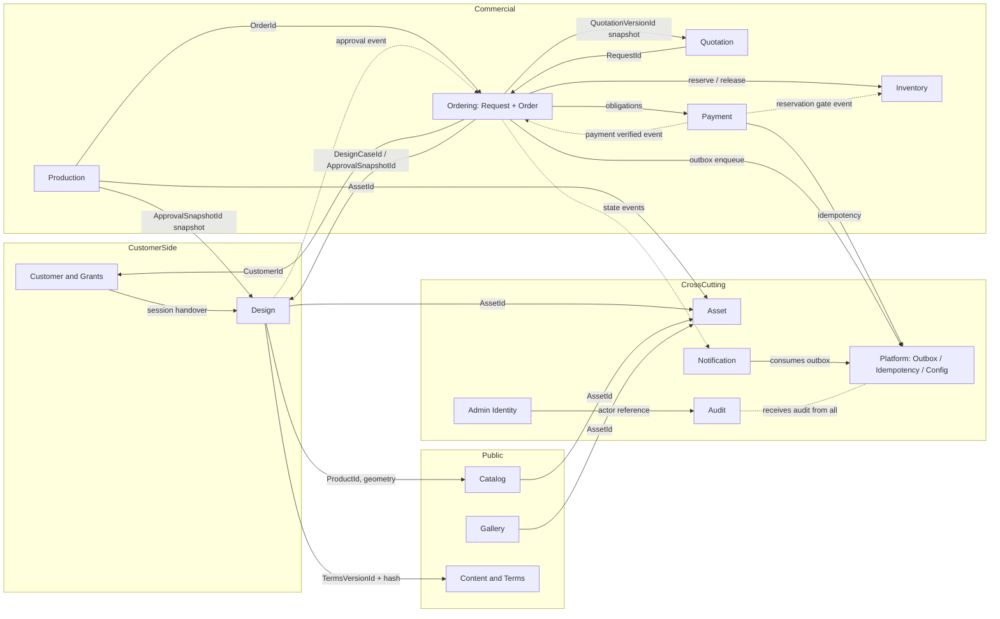

# DB2 — Bounded Context Map

**Date:** 2026-07-15 · **Git HEAD:** `f90f78c`
**Nature:** Conceptual. Contexts map to backend modules per
[`DB2_PACKAGE_MODULE_MAPPING.md`](./DB2_PACKAGE_MODULE_MAPPING.md); no physical
schema is implied (single `public` PostgreSQL schema per ADR-DB1-005).

## 1. Context decisions and rationale

| Question (task §9) | Decision | Rationale |
|---|---|---|
| Request: own context or Ordering? | **Inside Ordering (CTX-ORD)** as a separate aggregate | Repo baseline has one `order` module (list is non-exhaustive but request→order is one commercial case with shared ownership of the customer's case history; separate aggregates give the needed lifecycle separation without a module boundary between them). |
| Shipping: Order or separate? | **Order-owned** (entity in Order aggregate) | Manual, no API/tracking (D-017); no independent lifecycle beyond order transitions; ADR-DB2-002. |
| Gallery vs Content split? | **Separate contexts** | Both public content, but Gallery is a distinct module in the locked architecture (`SYSTEM_ARCHITECTURE §8`) with its own publication/ordering workflow. |
| Admin identity vs Customer identity? | **Separate contexts** | Different credential models, threat models, lifecycles (D-018 vs guest/secure-link flow); no shared identity concept. |
| Terms/Policy: Content or own Policy context? | **Content context owns Agreement/Agreement Version** | One admin, few policy documents; a dedicated Policy context is over-structure; versioning semantics live on the aggregate ([`DB2_TERMS_VERSION_DECISION.md`](./DB2_TERMS_VERSION_DECISION.md)). |
| Outbox/idempotency: module or shared infrastructure? | **Platform (workflow infrastructure) owner, not a business module** | They are delivery/duplication mechanics with no business invariants of their own; closes the ADR-DB1-005 rule-5 deferred assignment. Not a "generic shared business module" (BACKEND_CONVENTIONS §22) — infrastructure concepts only. |
| Content module absence in repo list | Content maps to a **new `content` backend module** | `REPOSITORY_STRUCTURE §7` says modules "include" (non-exhaustive); REQ-SEO-001..004 need an owner; recorded in package mapping. |

## 2. Context register

| ID | Name | Purpose | Owns (aggregates/records) | Does NOT own | Key invariants | Lifecycles | Upstream (consumes) | Downstream (consumed by) | Integration style out | Class | Tx sensitivity |
|---|---|---|---|---|---|---|---|---|---|---|---|
| CTX-IDN | Identity (Admin) | Admin authentication/session | AGG-01 Admin Account | Customer identity | REQ-IDN-001 single admin | LC-01 | — | all admin operations (actor ref) | identity reference; audit events | sec | low |
| CTX-CUS | Customer | Customer identity, contacts, verification, secure grants | AGG-02 Customer, AGG-03 Verification Challenge, AGG-04 Secure Access Grant | Requests, orders, sessions | INV-08 grant scope; verified-before-submit (BR-014) | LC-02, LC-03 | NTF (delivery), DSN (session handover) | ORD, QUO, PAY, DSN (CustomerId refs) | identity reference; app service (verify/issue grant); events | cpriv/sec | medium (challenge races) |
| CTX-CAT | Catalog | Store products, structure for design/preview, publication | AGG-05 Category, AGG-06 Product (variants, SKUs, sides, areas, media) | Stock state, asset binaries, templates | Product/SKU definition integrity | LC-04, LC-05 (definition side) | AST (media refs) | DSN, INV, ORD, QUO (Product/Variant/SKU refs, snapshots) | identity reference + display snapshot | pub | low |
| CTX-INV | Inventory | Stock truth: ledger, holds, reservations | AGG-07 SKU Stock | SKU definition, order state | INV-05, INV-18, INV-19 | LC-05 (stock side), LC-17 | CAT (SKUId), ORD/PAY (reservation triggers) | CAT (availability projection), ORD | app service (reserve/release/consume); ledger events | int | **critical** |
| CTX-AST | Asset | Binary metadata, inspection, derivatives, access scope | AGG-08 Asset | Semantic association (what an asset means to a request/product) | INV-09/10/21/22 | LC-06 | upload flows (all) | CAT, DSN, ORD, PRD, GAL (AssetId refs) | identity reference; app service (signed access); worker jobs | mixed | medium (idempotent processing) |
| CTX-DSN | Design | Sessions, design cases/versions, approval snapshots, templates | AGG-09 Session, AGG-10 Design Case, AGG-11 Approval Snapshot, AGG-12 Template | Request state, order state, asset binaries | INV-01/03/16/17/32 | LC-07..LC-10 | CAT (product geometry), CUS (grant-scoped access), AST | ORD, QUO, PAY (gates), PRD (ApprovalSnapshotId) | snapshot (approval); events; identity refs | cpriv | **critical** (approval, single-active-review) |
| CTX-ORD | Ordering | Custom request case + order + shipping | AGG-13 Custom Request, AGG-15 Order | Design versions, quotation pricing, payment truth, stock | REQ-ORD-003/005 transition guards; INV-12 snapshots; INV-13 | LC-11, LC-14, LC-19, LC-21 (order side) | CUS, DSN, QUO, PAY, INV (refs/snapshots/events) | PRD, PAY, NTF, read models | orchestration app services; events; snapshots | cpriv+fin | **critical** (creation, completion) |
| CTX-QUO | Quotation | Manual pricing, immutable versions, acceptance | AGG-14 Quotation | Order creation, payment | INV-02/12 sent-version immutability | LC-12, LC-13 | ORD (request ref), CAT (price inputs snapshot) | ORD (accepted snapshot), PAY (derivation) | snapshot; identity refs; events | fin | high (version creation) |
| CTX-PAY | Payment | Obligations, attempts, callbacks, reconciliation, refunds | AGG-16 Payment Obligation (+ module records CON-102/104/105) | Order transitions (it emits facts; Ordering transitions) | INV-04/07/15/19 | LC-15, LC-16, LC-20 | ORD (obligation source), QUO (amounts) | ORD (satisfaction events), INV (reservation gate), AUD | events via outbox; app service; idempotency | fin/sec | **critical** (callback races) |
| CTX-PRD | Production | Production jobs against exact approvals | AGG-17 Production Job | Approval content, order state | INV-03/06 | LC-18 | ORD (order ref), DSN (ApprovalSnapshotId), AST (artifacts) | ORD (completion events) | identity refs + spec snapshot; events | prod | high (guarded start) |
| CTX-GAL | Gallery | Published showcase | AGG-18 Gallery Entry | Asset binaries, product truth | publication only | pub-state | AST, CAT (links) | public read | identity refs | pub | low |
| CTX-CNT | Content | SEO pages, redirects, agreements/terms | AGG-19 Content Page, AGG-20 Redirect Rule, AGG-21 Agreement(+Versions) | Product/gallery SEO values (they embed the VO) | Agreement version immutability | pub-state | — | public read; DSN (terms reference in approval) | identity reference + content hash | pub | low |
| CTX-NTF | Notification | Delivery intents + attempts | AGG-22 Notification Intent | Message triggering business state; outbox | ADR-DB2-003 rules; no secrets persisted | intent/attempt | PLT (outbox events), CUS/ORD/PAY (event payload refs) | AUD (evidence) | consumes events; provider port | cpriv(min) | medium (idempotent delivery) |
| CTX-AUD | Audit | Business action evidence | CON-150 Audit Event (record) | Domain state/history (never replaces it) | INV-14 append-only | — | all contexts (emit) | admin read | append via app service | int | low |
| CTX-PLT | Platform (Workflow Infrastructure) | Outbox, idempotency, job attempts, policy configuration | CON-140/141/143 records, AGG-23 Business Policy Configuration | Any business state | INV-23/24 | LC-22, LC-23 | all contexts (enqueue/check) | worker, all contexts (config reads) | shared infrastructure services (narrow ports) | int | **critical** (claim/dedup) |

## 3. Context diagram

Legend: solid arrow = identity reference / app-service call direction (caller →
owner); dashed = domain event via outbox; thick label `snapshot` = immutable
snapshot handed downstream. No physical tables implied.

## 4. Inputs / outputs summary per context

Detailed per-relationship semantics live in
[`DB2_RELATIONSHIP_MODEL.md`](./DB2_RELATIONSHIP_MODEL.md); workflow-level
sequencing in [`DB2_CROSS_CONTEXT_WORKFLOWS.md`](./DB2_CROSS_CONTEXT_WORKFLOWS.md).
No context reads or writes another context's persistence directly
(ADR-DB1-009); every arrow above is an application-contract or event
relationship, and cross-context data at rest is either an ID reference or an
immutable snapshot (never a live foreign object graph).
