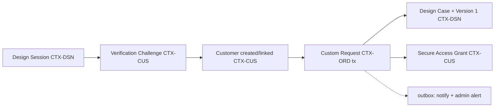
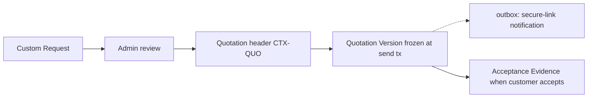
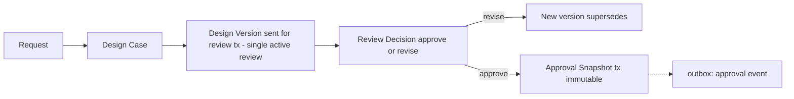
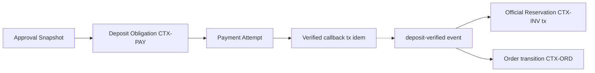
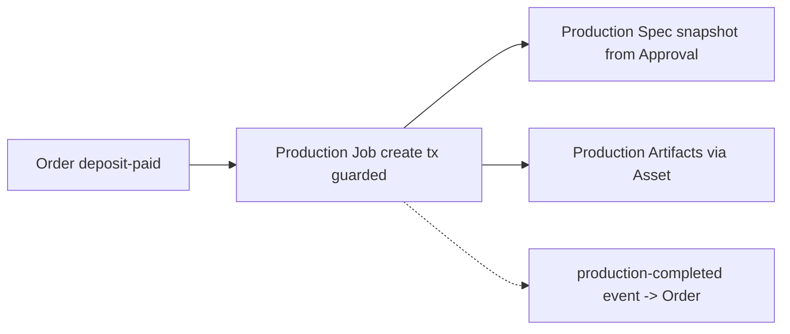
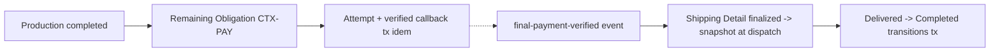
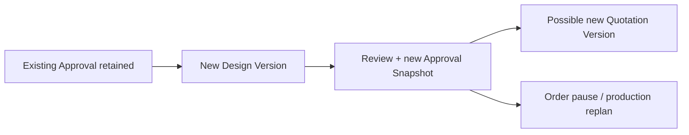

# DB2 — Cross-Context Workflow Map

**Date:** 2026-07-15 · **Git HEAD:** `f90f78c`
**Nature:** Conceptual orchestration only. Transaction candidates detailed in
[`DB2_TRANSACTION_BOUNDARY_CANDIDATES.md`](./DB2_TRANSACTION_BOUNDARY_CANDIDATES.md).
Unresolved guards stay with DB3 (GAP-03 acceptance-vs-approval ordering,
GAP-04/O-009 cancellation/refund, deposit reuse) — every workflow below marks
them instead of resolving them.

Common legend: `[tx]` = transaction candidate; `(outbox)` = post-commit side
effect via CON-140; `{idem}` = idempotency point (CON-141); `«audit»` = audit
event required.

## W1 — Guest design to submitted request

- **Contexts:** DSN, CUS, ORD, AST (uploads), NTF, PLT.
- **Source→target aggregates:** AGG-09 → AGG-02/AGG-03 → AGG-13 (+AGG-10, AGG-04).
- **Identity refs:** session→ProductId/AssetIds; request→CustomerId; grant→(CustomerId, RequestId).
- **Snapshot boundary:** submitted design document becomes formal Design Version content (frozen at send); session remains disposable.
- **[tx] candidates:** verified-contact→customer link; request submission (request + design case + version-1 + grant + outbox).
- **{idem}:** submission key (REQ-REQ-004); challenge issuance.
- **«audit»:** verification result, request created.
- **DB3 guards:** verified-before-submit precondition wording; session→request field mapping; grant expiry.

## W2 — Request to quotation

- **Contexts:** ORD, QUO, CUS (grant access), NTF.
- **Snapshot boundary:** pricing inputs + product/variant display frozen inside the version at send (INV-12); deposit/remaining derivation recorded from config.
- **[tx]:** quotation version creation; acceptance recording.
- **{idem}:** acceptance via secure flow (duplicate clicks).
- **«audit»:** quotation sent/accepted.
- **DB3 unresolved:** whether acceptance gates digitizing and how it orders against design approval (GAP-03/DEC-16) — model supports both orders (acceptance evidence is independent of approval snapshot).

## W3 — Design review and approval

- **Contexts:** DSN, CUS (grant), ORD (request state), CNT (terms ref), NTF.
- **Snapshot boundary:** Approval Snapshot (CON-056) freezes version ref + hashes + specs + contact snapshot + Terms Acceptance Reference.
- **[tx]:** send-for-review (enforce INV-16 single active); approval snapshot creation.
- **{idem}:** approval action (duplicate submits return same snapshot).
- **«audit»:** version sent, review decision, approval (critical).
- **DB3 guards:** who may VOID; review expiry; re-verification triggers (GAP-12 untouched).

## W4 — Approval to deposit and official reservation

- **Contexts:** DSN (gate input), PAY, INV, ORD, PLT, NTF.
- **Identity refs:** obligation→OrderId/QuotationVersionId; reservation→(SKUId, OrderId).
- **[tx]:** callback application (attempt + obligation + callback event + idempotency + outbox); official reservation creation (stock aggregate, row-locked).
- **{idem}:** provider callback (server-side provider ref key — never client-only); reservation creation idempotent per order.
- **«audit»:** payment state change, reservation created.
- **Orchestration note:** payment application and reservation are **two transactions coordinated by events** — a single cross-context DB transaction is not required by the architecture and is not assumed (§18 rule).
- **DB3 guards:** insufficient-stock-at-reservation behavior (ADR-DB1-018 deferral); order creation timing relative to approval/acceptance (GAP-03).

## W5 — Production

- **Contexts:** ORD, PRD, DSN (snapshot read), AST.
- **Guards ([tx] at creation/start):** approved design + verified deposit + reservation (INV-06 inputs); spec frozen from exact ApprovalSnapshotId (INV-03).
- **«audit»:** production start/complete.
- **DB3:** rework/revision handling (DEC-23 untouched).

## W6 — Final payment and delivery

- **Contexts:** PRD (fact), PAY, ORD, NTF.
- **Snapshot boundary:** shipping detail frozen at dispatch (ADR-DB2-002).
- **[tx]:** callback application; delivery/completion transitions (guards: delivery requires verified remaining payment; completion after delivery — REQ-ORD-005).
- **{idem}:** callbacks; delivered/completed idempotent re-marks.
- **«audit»:** payment, delivery, completion.

## W7 — Post-approval revision

- **Contexts:** DSN, QUO, ORD, PRD, PAY (deposit question).
- **Rules already locked:** prior approval retained historically (J10, `06 §10`); production must reference latest valid approval (INV-03).
- **[tx]:** new version creation; new approval snapshot.
- **«audit»:** reopen, new approval.
- **DB3 unresolved (explicitly not decided):** deposit reuse (O-009), order pause semantics, production hold/replan states (DEC-23), possible new quotation requirement rules.

## Cross-workflow observations for DB3/DB8

- Every provider-facing step (payment callbacks, asset processing callbacks,
  notification delivery) sits behind {idem} with server-side keys.
- Event-driven joints (deposit-verified → reservation/order; production
  completed → obligation) are the DB8 race hotspots together with INV-16 and
  duplicate order creation.
- No workflow requires a cross-context single DB transaction; all
  multi-context consistency is orchestrated via use-case transactions + outbox
  events, per ADR-DB1-009.
