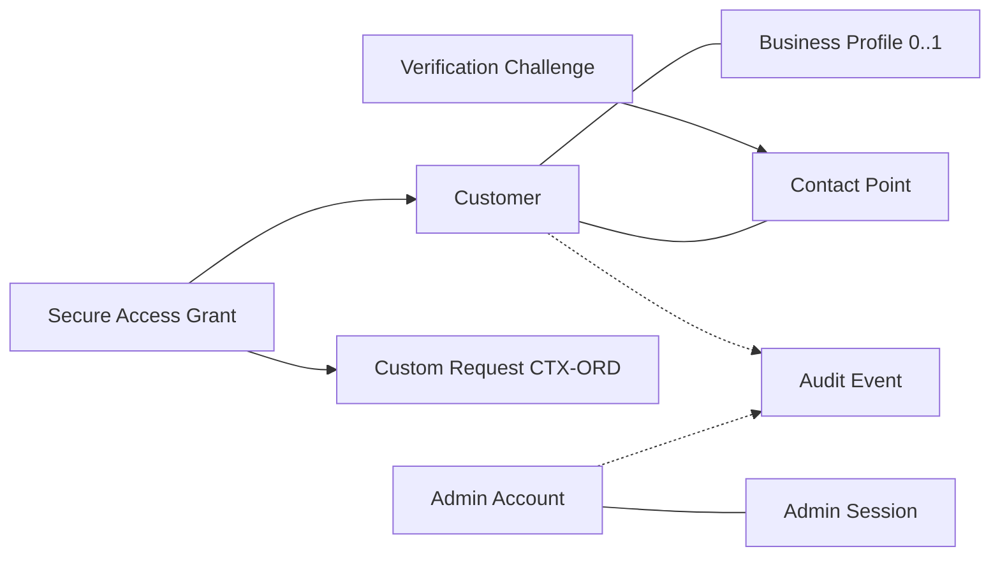
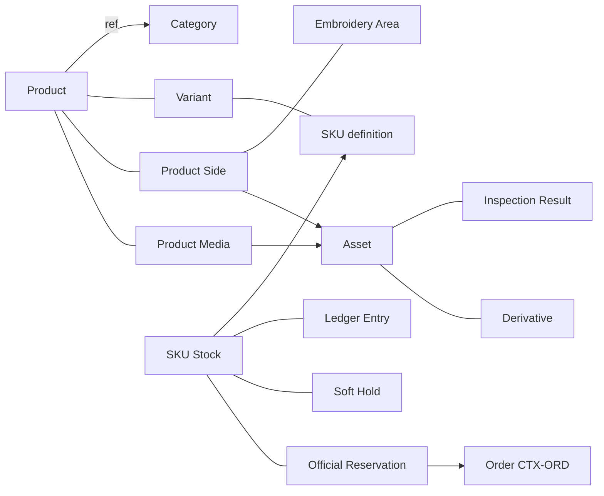
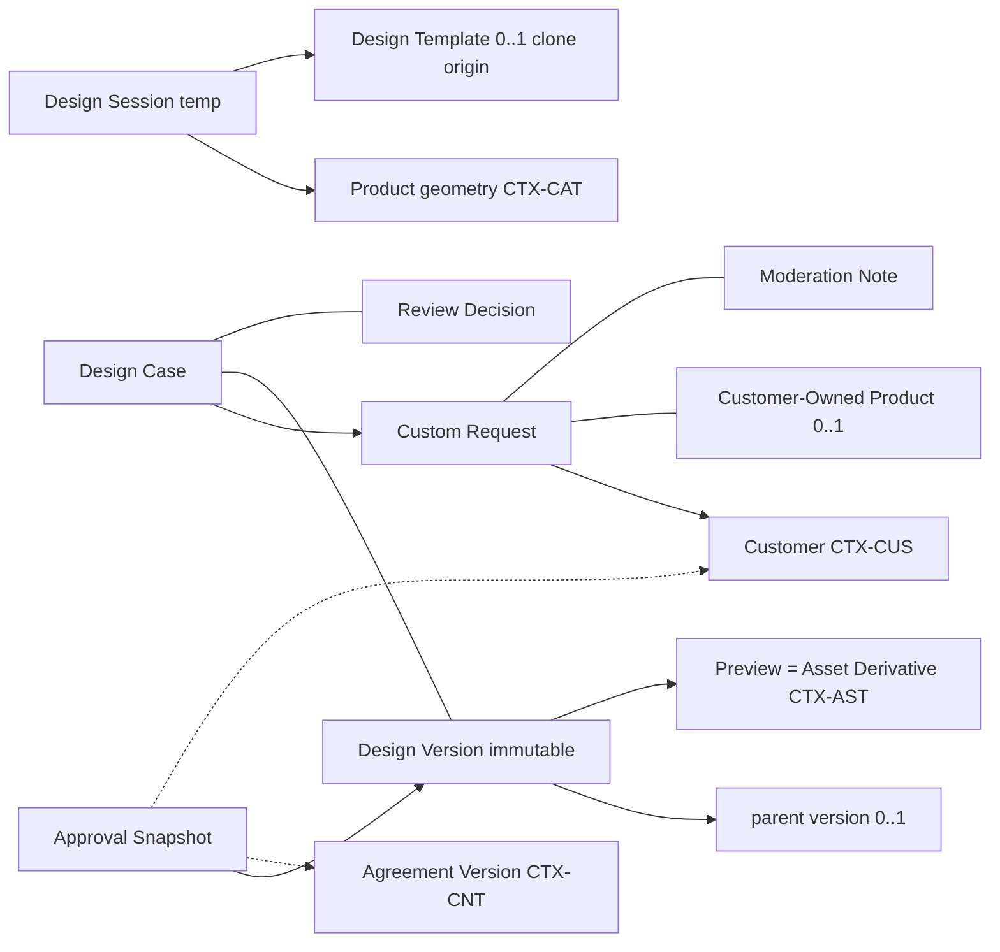
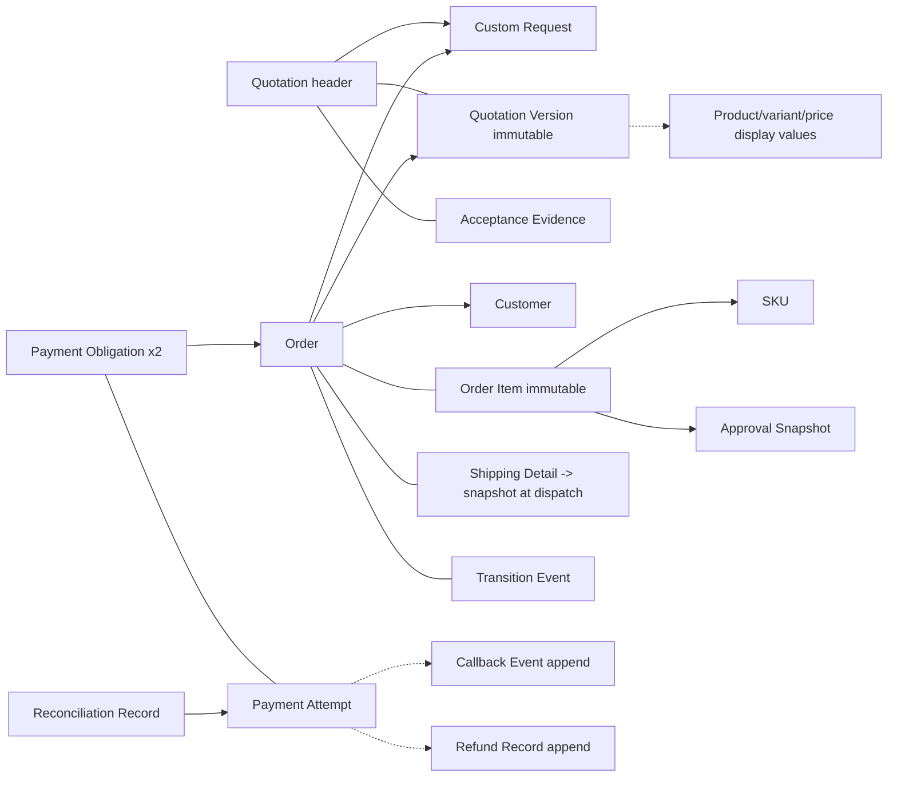
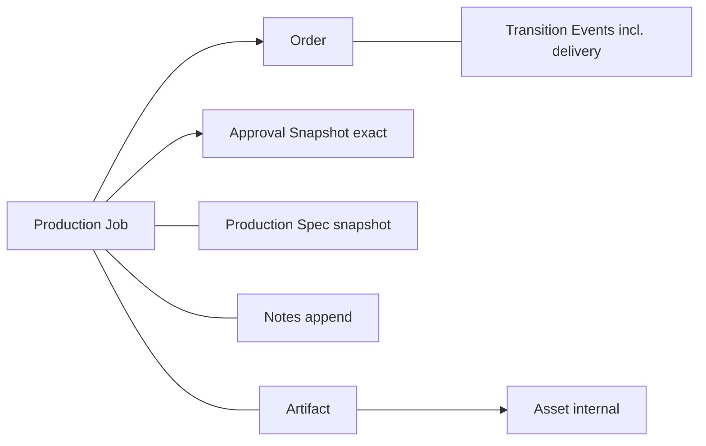
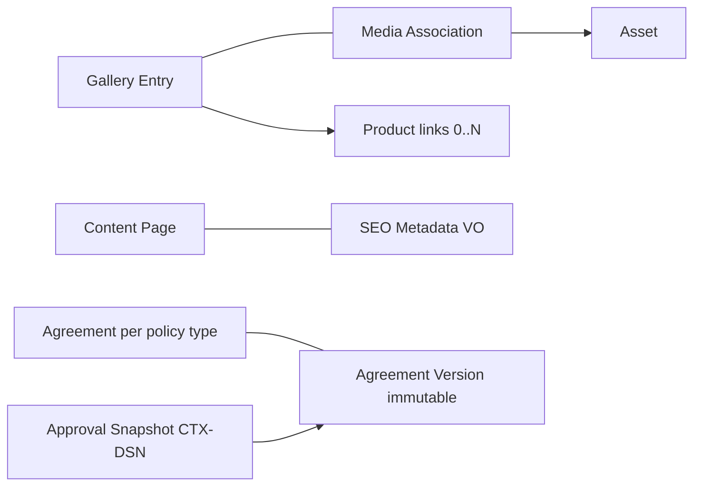
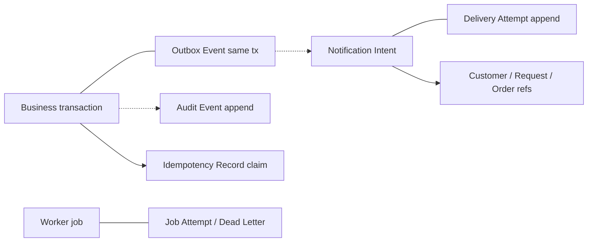

# DB2 — Relationship & Cardinality Model

**Date:** 2026-07-15 · **Git HEAD:** `f90f78c`
**Nature:** Conceptual relationships only — no FK/PK/index/table design.

## 1. Legend

- **Card:** 1–1, 1–N, N–1, N–N; `0..` marks optional.
- **Own:** `comp` composition (child lives inside aggregate) · `ref` identity
  reference (ID only) · `snap` immutable snapshot copy · `derived` projection.
- **XCtx:** crosses context boundary. **Tx:** transactionally coupled (same
  use-case transaction). **Hist:** relationship must survive historically.
- Diagram legend: solid line `---` = composition; arrow `-->` = identity
  reference; dotted arrow `-.->` = snapshot copy taken or event/derived flow
  (disambiguated by the tables, which are normative).

## 2. Identity + Customer + Secure Access

| Source | Target | Card | Own | Lifecycle dep. | Delete/archive direction | XCtx | Tx | Hist | Notes |
|---|---|---|---|---|---|---|---|---|---|
| Customer | Contact Point | 1–N | comp | contact dies with customer (anonymize) | anonymize fields, keep rows | no | yes | yes | one primary; verified flag |
| Customer | Business Profile | 1–0..1 | comp | dormant | with customer | no | yes | no | future-ready |
| Verification Challenge | Contact Point | N–1 | ref | challenge transient | hard-delete challenge after TTL | no | no | no | verified result recorded on contact + audit |
| Secure Access Grant | Customer | N–1 | ref | grant ≠ identity | grant expires/revoked independently | no | no | yes (evidence) | ADR-DB2-001 |
| Secure Access Grant | Custom Request | N–1 | ref | scoped to one request | revoke on request terminal state (DB3) | yes (→ORD) | no | yes | INV-08 |
| Admin Account | Admin Session | 1–N | comp | sessions revocable | operational cleanup | no | yes | no | |
| Admin/Customer actions | Audit Event | 1–N | ref (actor) | append-only | audit retention class | yes (→AUD) | no | yes | actor reference only |

## 3. Catalog + Inventory + Asset

| Source | Target | Card | Own | Lifecycle dep. | Delete/archive | XCtx | Tx | Hist | Notes |
|---|---|---|---|---|---|---|---|---|---|
| Category | Product | 1–N | ref (product → CategoryId) | independent | archive category blocks new listing only | no | no | no | |
| Product | Variant / Product Side / Embroidery Area / Product Media | 1–N each | comp | children with product | archive with product | no | yes | yes (referenced by history via snapshots) | |
| Variant | SKU | 1–N | comp | with product | archive | no | yes | yes | SKU definition |
| Product Media / Side background | Asset | N–1 | ref | asset independent | tombstone coordination (ADR-DB1-011) | yes (→AST) | no | yes | AssetId only |
| SKU Stock | SKU | 1–1 | ref | stock exists while SKU sellable | stock records retained (ledger = commercial) | yes (→CAT) | no | yes | Inventory truth |
| SKU Stock | Ledger Entry / Soft Hold / Official Reservation | 1–N each | comp | within stock aggregate | ledger append-only retained; holds operational | no | yes | ledger yes | |
| Official Reservation | Order | N–1 | ref | created after approval+deposit | released per policy (DB3) | yes (→ORD) | no | yes | INV-05 |
| Asset | Inspection Result / Derivative | 1–N each | comp | with asset | tombstone two-phase | no | inspection no / derivative no | yes | worker idempotent |

## 4. Design + Request + Approval

| Source | Target | Card | Own | Lifecycle dep. | Delete/archive | XCtx | Tx | Hist | Notes |
|---|---|---|---|---|---|---|---|---|---|
| Design Session | Product/Variant/Side/Area | N–1 | ref | session transient | session hard-deleted after TTL | yes (→CAT) | no | no | |
| Design Session | Design Template | N–0..1 | ref (clone origin) + independent working copy | none after clone | — | no | no | no | clone-on-use; no live link |
| Custom Request | Customer | N–1 | ref | request retained | PII via customer anonymization | yes (→CUS) | no | yes | |
| Custom Request | Customer-Owned Product / Moderation Note | 1–0..1 / 1–N | comp | with request | retained | no | yes | yes | INV-13 |
| Design Case | Custom Request | 1–1 | ref | case exists for one request | retained | yes (DSN↔ORD) | creation yes | yes | request holds current DesignCaseId pointer |
| Design Case | Design Version | 1–N | comp | versions never lost | retained forever (REQ-DVER-005) | no | yes | yes | parent-version chain (version→version N–0..1 self ref) |
| Design Case | Review Decision | 1–N | comp | append-only | retained | no | yes | yes | |
| Design Version | Asset (preview derivative) | 1–0..1 | ref | preview regenerable | derivative per parent retention | yes (→AST) | no | yes (preview hash frozen in snapshot) | |
| Approval Snapshot | Design Version | 1–1 | ref + hash | snapshot immutable | never deleted while commercial history exists | no | **yes** (created in approval tx) | yes | INV-01/03 |
| Approval Snapshot | Agreement Version | N–1 | ref + content hash | terms version immutable | retained | yes (→CNT) | no | yes | CON-129 |
| Approval Snapshot | Customer | N–1 | ref + contact snapshot | snapshot keeps contact copy | anonymization affects live customer, not snapshot policy (DB3/business w/ privacy rules) | yes (→CUS) | no | yes | |

## 5. Quotation + Order + Payment

| Source | Target | Card | Own | Lifecycle dep. | Delete/archive | XCtx | Tx | Hist | Notes |
|---|---|---|---|---|---|---|---|---|---|
| Quotation | Custom Request | 1–1 (per case; revisions are versions) | ref | retained | retained | yes | no | yes | request holds current QuotationId |
| Quotation | Quotation Version | 1–N | comp | versions immutable once sent | retained | no | **yes** (version creation tx) | yes | INV-02 |
| Quotation Version | Product/Variant display | — | **snap** | frozen at send | n/a | yes (values from CAT) | no | yes | INV-12: no live price refs |
| Quotation | Acceptance Evidence | 1–0..N | comp | append | retained | no | yes | yes | ordering vs approval → DB3 |
| Order | Custom Request / Customer | N–1 / N–1 | ref | retained | retained | ORD internal / →CUS | no | yes | |
| Order | Quotation Version (accepted) | 1–1 | ref + snap of commercial terms into Order Items | frozen | retained | yes (→QUO) | creation yes | yes | |
| Order | Order Item | 1–N | comp (immutable) | with order | retained | no | yes | yes | per-SKU lines from Quantity Breakdown |
| Order Item | SKU / Approval Snapshot | N–1 / N–1 | ref (+display snap) | retained | retained | yes (→CAT/DSN) | no | yes | production integrity chain |
| Order | Shipping Detail | 1–0..1 | comp (mutable → immutable at dispatch) | with order | PII anonymize after retention | no | yes | yes | ADR-DB2-002 |
| Order | Transition Event | 1–N | comp append | retained | retained | no | yes | yes | actor/reason |
| Payment Obligation | Order | N–1 (2 per order typical) | ref | retained | retained | yes (PAY→ORD) | no | yes | deposit + remaining independent (INV-04) |
| Payment Obligation | Payment Attempt | 1–N | comp | retained | retained | no | yes | yes | |
| Payment Attempt | Callback Event | 1–N | ref (module records) | append | retained | no | callback application **tx** | yes | INV-07 with idempotency record |
| Payment Attempt | Refund Record | 1–0..N | ref | append | retained | no | tx | yes | policy DB3 |
| Reconciliation Record | Attempt/Obligation | N–1 | ref | append | retained | no | tx | yes | manual review |

## 6. Production + Shipping/Delivery

| Source | Target | Card | Own | Lifecycle dep. | Delete/archive | XCtx | Tx | Hist | Notes |
|---|---|---|---|---|---|---|---|---|---|
| Production Job | Order | N–1 (1 active; rework → DB3) | ref | job retained | retained | yes | no | yes | |
| Production Job | Approval Snapshot | N–1 | ref + hash | exact version (INV-03) | retained | yes (→DSN) | start guard tx | yes | |
| Production Job | Production Specification | 1–1 | comp snap | frozen at creation | retained | no | yes | yes | |
| Production Job | Note / Artifact | 1–N | comp | notes append; artifacts via AssetId | artifacts per retention | AST for binary | no | yes | internal only (INV-21/22) |
| Delivery events | Order Transition Event | — | comp (order) | append | retained | no | yes | yes | delivery/completion gates → DB3 |

## 7. Content + Gallery + Terms

| Source | Target | Card | Own | Notes |
|---|---|---|---|---|
| Gallery Entry | Media Association → Asset | 1–N → N–1 | comp → ref | public derivatives only |
| Gallery Entry | Product / Service page | N–0..N | ref (links) | SEO internal links |
| Content Page | SEO Metadata | 1–1 | comp VO | same VO type as Product/Category/Gallery |
| Agreement | Agreement Version | 1–N | comp (immutable once published) | published/effective/superseded |
| Approval Snapshot | Agreement Version | N–1 | ref + content hash | cross-context, historical |

## 8. Notification + Audit + Outbox + Idempotency

| Source | Target | Card | Own | Notes |
|---|---|---|---|---|
| Business tx (any context) | Outbox Event | 1–N | append in same tx | INV-23; relay dispatches post-commit |
| Outbox Event | Notification Intent | 1–0..N | consumed event → intent created | NTF owns intent; outbox is transport trigger (distinct concepts, ADR-DB2-003) |
| Notification Intent | Delivery Attempt | 1–N | comp append | bounded retries; dead-letter |
| Notification Intent | Customer/Request/Order | N–1 | ref | payload = template ref + redacted params |
| Any sensitive action | Audit Event | 1–N | append | actor/action/target; never substitutes domain history |
| Any idempotent operation | Idempotency Record | 1–1 per (namespace, scope key) | check/claim | fingerprint conflict = error (ADR-DB1-017) |
| Worker job | Job Attempt / Dead Letter | 1–N | append | operational |

## 9. Global rules

1. Every cross-context relationship above is **identity reference or
   snapshot** — never a live foreign object graph (§8.3).
2. Snapshot boundaries (quotation pricing, accepted terms, approval, order
   items, shipping at dispatch, production spec, terms version, contact
   snapshot) are enumerated normatively in
   [`DB2_SNAPSHOT_AND_HISTORY_MODEL.md`](./DB2_SNAPSHOT_AND_HISTORY_MODEL.md).
3. Delete/archive directions follow the ADR-DB1-011 category framework; no
   relationship may cascade a hard delete into commercial/audit history.
4. Cardinalities marked provisional by lifecycle questions (active production
   jobs per order, refunds per attempt) are DB3 decisions; the model keeps
   them open as 1–N with a documented note rather than locking guards early.
