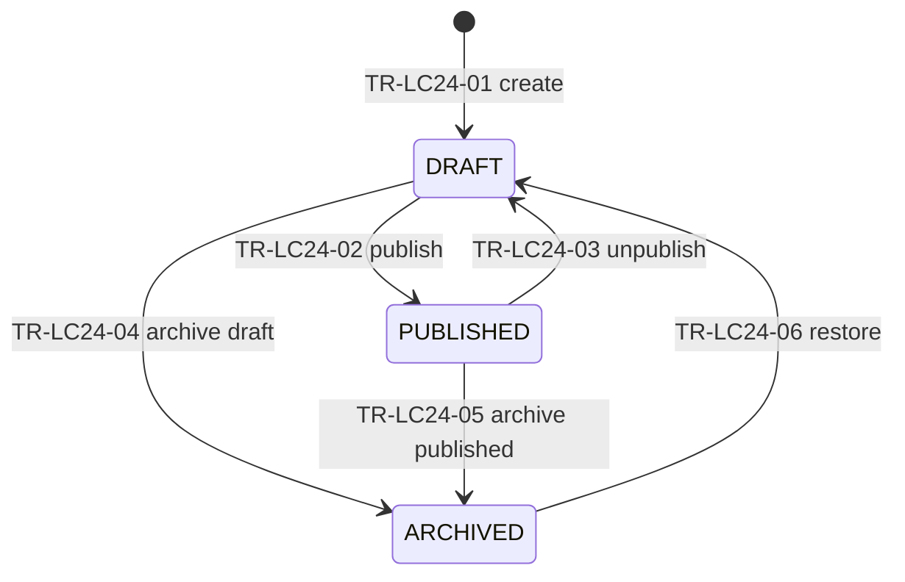

# DB3 — Lifecycle Specifications (Master)

**Checkpoint:** DB3 — Lifecycle & Invariant Specification
**Date:** 2026-07-15 · **Git HEAD:** `0563866` · **Branch:** `production`
**Nature:** Conceptual state machines. No tables/columns/SQL. Status storage
remains text + CHECK (ADR-DB1-008); names below are the **final official
state names** (GAP-01 resolved).

Conventions: transitions `TR-LCxx-nn`; guards `GRD-nnn`
([`DB3_TRANSITION_GUARD_CATALOG.md`](./DB3_TRANSITION_GUARD_CATALOG.md));
side effects `SE-nnn`
([`DB3_SIDE_EFFECT_OUTBOX_CATALOG.md`](./DB3_SIDE_EFFECT_OUTBOX_CATALOG.md)).
Every transition implicitly carries GRD-019 (transition legality — only
listed transitions are valid; everything else rejected) and GRD-025 (actor
authorization); they are not repeated per row. "Audit" = audit event with
actor/timestamp (+reason where marked R). After-commit effects go via outbox
(INV-23). Diagrams: [`DB3_STATE_DIAGRAMS.md`](./DB3_STATE_DIAGRAMS.md).

**GAP-01 synonym eliminations (locked):** session `ABANDONED` → merged into
`EXPIRED` (distinction had no behavioral difference; retention treats both
identically); quotation `REVISED` → replaced by version-level `SUPERSEDED`
(revision creates a new version — "revised" described the event, not a
state); delivery has no separate machine (order states + shipping freeze);
approval has no state machine (immutable snapshot exists-or-not; operational
supersession = order pointer, ADR-DB3-003 rule 4).

---

## LC-01 — Admin Account (+ Admin Session)

- **Owner:** CTX-IDN / AGG-01. **Authority:** authoritative.
- **Account states:** `ACTIVE` (initial) · `LOCKED` (rate-limit/security
  lockout, recoverable) · `DISABLED` (admin replaced/retired; terminal for
  that account record). **Session states:** `ACTIVE` (initial) → `EXPIRED` |
  `REVOKED` (both terminal).
- **REQ/INV/DEC:** REQ-IDN-001..004; O-005 provider open.

| TR | From→To | Actor | Guards | In-tx | After-commit | Audit | Idem | Conc |
|---|---|---|---|---|---|---|---|---|
| TR-LC01-01 | ACTIVE→LOCKED | system (failed-attempt policy) | attempt-limit config | account flag | SE-016 login alert | yes | natural | low |
| TR-LC01-02 | LOCKED→ACTIVE | admin recovery procedure | recovery verification (provider-dependent, O-005) | unlock | notify | yes R | yes | low |
| TR-LC01-03 | ACTIVE→DISABLED | replacement procedure | replacement admin exists (REQ-IDN-001: exactly one ACTIVE) | disable + create successor | notify | yes R | yes | low |
| TR-LC01-04 | session ACTIVE→REVOKED | admin | — | revoke | — | yes | yes | revoke-vs-use: revoke wins at tx check |
| TR-LC01-05 | session ACTIVE→EXPIRED | system sweep | expiry timestamp | mark | — | no (operational) | natural | low |

Invalid: DISABLED→ACTIVE (create successor instead). Timeout: session expiry
sweep. **DB4:** exactly-one-ACTIVE-admin uniqueness candidate. **DB7:**
single-active-admin; **DB8:** revoke-vs-use.

---

## LC-02 — Contact Verification Challenge

- **Owner:** CTX-CUS / AGG-03. **Authority:** authoritative (short-lived).
- **States:** `ISSUED` (initial) → `VERIFIED` | `FAILED` | `EXPIRED` |
  `CANCELLED` (all terminal). Attempts = append-only records under the
  challenge.
- **REQ/INV:** REQ-VERIF-001; used for submission (GRD-001) and step-up
  (GRD-003, ADR-DB3-004).

| TR | From→To | Actor | Guards | In-tx | After-commit | Audit | Idem | Conc |
|---|---|---|---|---|---|---|---|---|
| TR-LC02-01 | (create)→ISSUED | system on request | GRD-026 rate/cooldown; contact exists | challenge row | SE-001 send code (no secret persisted outside challenge store) | yes | `verification.issue` per (contact, purpose) — reuse open challenge | concurrent issue collapses to one open challenge per (contact,purpose) |
| TR-LC02-02 | ISSUED→VERIFIED | customer | code match; not expired; GRD-026 attempts | mark + record attempt; **on submission purpose:** link/create Customer (ADR-DB2-001 rule 5) in same use case | SE-002 grant issue (submission flow) | yes | replay returns VERIFIED | verify-vs-expire race: expiry checked in-tx |
| TR-LC02-03 | ISSUED→FAILED | system | attempt limit exceeded | mark | abuse signal | yes | natural | — |
| TR-LC02-04 | ISSUED→EXPIRED | sweep | expires_at passed | mark | — | no | natural | vs TR-02: tx wins |
| TR-LC02-05 | ISSUED→CANCELLED | system (superseded by new challenge) | — | mark | — | no | yes | — |

Retry: new challenge (never reopen). Retention: transient. **DB4:** one open
challenge per (contact, purpose) partial-uniqueness candidate. **DB8:**
concurrent verify (CC-17).

---

## LC-03 — Secure Access Grant

- **Owner:** CTX-CUS / AGG-04. **Authority:** authoritative.
- **States:** `ACTIVE` (initial) → `EXPIRED` | `REVOKED` (terminal). Policy:
  ADR-DB3-004.

| TR | From→To | Actor | Guards | In-tx | After-commit | Audit | Idem | Conc |
|---|---|---|---|---|---|---|---|---|
| TR-LC03-01 | (issue)→ACTIVE | system (submission / reissue) | one active grant per (customer,request) — supersedes prior | create (hashed token) + revoke prior | SE-002 secure-link notification | yes | `grant.issue` per request event | reissue serializes on grant row |
| TR-LC03-02 | ACTIVE→REVOKED | admin R / system (triggers per ADR-DB3-004 rule 5) | — | revoke | notify where appropriate | yes R(admin) | yes | **revoke-vs-in-flight: grant checked in action tx; revoke committed first wins (CC-16)** |
| TR-LC03-03 | ACTIVE→EXPIRED | sweep | expires_at | mark | — | no | natural | vs use: tx check wins |

**DB4:** hashed token uniqueness; single-active-grant partial uniqueness.
**DB7:** no plaintext token. **DB8:** CC-16.

---

## LC-04 — Product Publication

- **Owner:** CTX-CAT / AGG-06. **States:** `DRAFT` (initial) ↔ `PUBLISHED`
  (publish TR-LC04-01 / unpublish TR-LC04-05; edit in place while `DRAFT`,
  audited) → `ARCHIVED` (terminal-ish; unarchive = TR-LC04-04 allowed,
  audited).

| TR | From→To | Actor | Guards | Effects | Audit |
|---|---|---|---|---|---|
| TR-LC04-01 | DRAFT→PUBLISHED | admin | required public fields present | SEO/cache revalidation event | yes |
| TR-LC04-02 | PUBLISHED→ARCHIVED | admin | — (open cases keep their snapshots; INV-12) | delist event | yes R |
| TR-LC04-03 | DRAFT→(hard delete) | admin | never published & unreferenced (ADR-DB1-011) | — | yes |
| TR-LC04-04 | ARCHIVED→PUBLISHED | admin | fields still valid | relist | yes R |
| TR-LC04-05 | PUBLISHED→DRAFT | admin | current status is `PUBLISHED`; concurrency token matches | delist event; returns to the editable draft state | yes |
| TR-LC04-06 | DRAFT→ARCHIVED | admin | current status is `DRAFT`; concurrency token matches | durable catalog retirement; no public read model existed to delist | yes R |

### TR-LC04-05 — Unpublish Product (IMP-D035, APP2-B03-G01)

**Unpublish removes a product from public visibility without archiving or
deleting it.** It is the reverse of TR-LC04-01 and it is *not* archive: archive
is a durable catalog-retirement fact (TR-LC04-02), while unpublish returns the
product to the same editable `DRAFT` state it was authored in.

Before this transition existed, the only exit from `PUBLISHED` was archive, so
"withdraw this product from the storefront and keep editing it" had no canonical
representation at all — the gap `APP2-B03` blocked on.

**Postconditions.** `status = DRAFT` · public eligibility false (the product
leaves the `status='PUBLISHED'` predicate that scopes every public read) · the
row persists · `slug`, `category_id`, `name`, `description`,
`base_price_amount`, `currency_code`, `display_order`, `seo_*` and
`is_indexable` unchanged · ordered `product_media` unchanged · referenced Assets
and their derivatives unchanged · `updated_at` advances under the accepted
monotonic mechanism.

**Forbidden side effects.** It must never set `status = ARCHIVED`, write
`archived_at`, hard-delete anything, remove media links, delete Assets,
derivatives or stored objects, change the slug, clear the price or reset the
category.

**Editability.** Afterwards the product is editable again under the existing
`DRAFT` rules. **No `UNPUBLISHED` state exists** — introducing one would split
the editable state in two and every editing rule would have to name both.

**Readiness.** Unpublish destroys no readiness fact, so a product returned to
`DRAFT` may still satisfy every publication requirement. That is not permission
to re-publish automatically: **every later publish re-evaluates readiness inside
its own transaction** (TR-LC04-01's guard), because the facts it depends on —
category state, Asset eligibility, derivative readiness — are owned elsewhere
and can change while the product sits in `DRAFT`.

**Audit and event vocabulary** for TR-LC04-01 and TR-LC04-05 are specified in
`DB3_AUDIT_SPECIFICATION.md` (Product/catalog changes) and, for the durable
consequence, in the Outbox convention recorded by IMP-D035.

Category mirrors (DRAFT/PUBLISHED/ARCHIVED) with the same rules. Gallery
Entry and Content Page use the same publication machine (owner GAL/CNT) —
declared here once; per-aggregate diagrams unnecessary. **DB7:** archived
products invisible to new cases but historical snapshots intact.

---

### TR-LC04-06 — Archive Draft Product (IMP-D042, APP3-G02)

**Archive is durable catalog retirement, and it was already happening from
`DRAFT`.** `APP2-B02` delivered `adminProduct_archive` with
`PRODUCT_ARCHIVABLE_STATES = [PRODUCT_DRAFT_STATE]`
(`apps/api/src/modules/catalog/domain/product-draft.policy.ts`), while LC-04
authorised archive only from `PUBLISHED` (TR-LC04-02). That gap is
`FU-APP2-PRODUCT-ARCHIVE-LIFECYCLE-01`: a state was storable and a command
shipped, but no transition authorised it. This transition closes it by adding
the authority, not by changing the delivered behaviour.

**Distinct from unpublish.** TR-LC04-05 returns a *published* product to the
editable `DRAFT` state; TR-LC04-06 retires a *draft* product that was never
public. A draft has no public read model to delist, which is the only reason the
two rows differ in effect.

**Postconditions.** `status = ARCHIVED` · `archived_at` set · the row and all
of `product_media`, Assets, derivatives, placement rows, Design Templates,
Design Sessions and historical records persist — archive **never** hard-deletes
(TR-LC04-03 remains the only delete path, and only for a never-published,
unreferenced draft). An archived Product is never public.

**Consequence for scoped Templates.** A published Design Template scoped to an
archived Product becomes **derived-ineligible** — its own `status` is not
mutated and no cascade runs (LC-24 has no such transition). Relist
(TR-LC04-04) re-evaluates current Product publication readiness.

## LC-05 — SKU Availability (derived)

- **Authority: derived projection — never a transition source** (locked).
  `AVAILABLE` / `OUT_OF_STOCK` computed from: available balance (AGG-07) and
  catalog manual override. **Precedence (locked):** manual override
  `OUT_OF_STOCK` always wins for display; override can never force
  `AVAILABLE` when computed available ≤ 0. Staleness tolerance: display-only
  (reservation correctness never reads the projection — GRD-014 reads locked
  stock rows). Details: [`DB3_DERIVED_STATE_CATALOG.md`](./DB3_DERIVED_STATE_CATALOG.md).

---

## LC-06 — Asset Processing

- **Owner:** CTX-AST / AGG-08. **Asset states:** `UPLOADED` (initial) →
  `INSPECTING` → `ACCEPTED` | `REJECTED` (terminal for pipeline) →
  `DELETION_PENDING` → `DELETED` (tombstone terminal, two-phase per
  ADR-DB1-011). **Derivative states:** `PENDING` → `PROCESSING` → `READY` |
  `FAILED` (retry = new attempt, bounded).

| TR | From→To | Actor | Guards | In-tx | After-commit | Audit | Idem |
|---|---|---|---|---|---|---|---|
| TR-LC06-01 | (upload)→UPLOADED | system | size/MIME pre-checks | asset row | SE-013 inspection job | security-relevant | `asset.upload` per upload token |
| TR-LC06-02 | UPLOADED→INSPECTING | worker | claim | mark | — | no | job id |
| TR-LC06-03 | INSPECTING→ACCEPTED | worker | full validation `09 §4`; **catalog lane:** both required derivatives already READY in this same transaction | mark + inspection record (+ catalog derivatives READY) | SE-013 derivative jobs (**artwork lane only**) | yes | `asset.inspect` per asset+attempt |
| TR-LC06-04 | INSPECTING→REJECTED | worker | validation failure | mark + record | notify owner flow | yes | idem |
| TR-LC06-05 | ACCEPTED→DELETION_PENDING | retention/cleanup or admin R | not referenced by commercial history OR category allows | tombstone decision | SE-014 binary delete job | yes | `asset.delete` per asset |
| TR-LC06-06 | DELETION_PENDING→DELETED | worker | binary deleted confirmed | tombstone final | — | yes | idem |

Quarantine: `REJECTED` is the quarantine terminal; re-submission = new
asset. **DB8:** idempotent processing callbacks (CC-19).

### LC-06 lanes (APP2-DB01)

The single "derivatives are generated after ACCEPTED" reading above was
over-broad. Two lanes exist; the derivative *state* machine
(`PENDING → PROCESSING → READY | FAILED`) is identical in both, only the
timing relative to the parent asset differs.

**Catalog-media lane** (`kind = CATALOG_MEDIA`, owner `APP2-W01`): derivative
generation is the inspection. The worker prepares both required rows while the
asset is still `INSPECTING`, generates the binaries, and writes the terminal
tuple in one transaction:

| Step | Effect |
|---|---|
| prepare (short tx, before any object-store work) | insert-or-recover `THUMBNAIL` and `CATALOG_PREVIEW` at **`PENDING`**, then a guarded `PENDING → PROCESSING` transition for each |
| generate | private derivative binaries; no database write |
| accept (one tx) | both rows `PROCESSING → READY` · exactly one `ACCEPTED` inspection · asset `INSPECTING → ACCEPTED` |
| reject (one tx) | both rows `PROCESSING → FAILED` · exactly one `REJECTED` inspection · asset `INSPECTING → REJECTED` · original retained |

Rules this lane is bound by:

- a derivative row is **never inserted directly as `PROCESSING`** — `PENDING`
  stays the entry state, and the transition is a guarded update whose predicate
  names the expected current state (a recovered `PROCESSING` row is a
  retry/replay and does not move backwards through `PENDING`);
- the asset does **not** reach `ACCEPTED` until both required derivatives are
  `READY` **in the same transaction**;
- a derivative must **never** become `READY` for an asset that has already
  reached `REJECTED`.

**Design/artwork lane** (`PREVIEW_WATERMARKED` / `NORMALIZED` / `MOCKUP`):
unchanged. Those derivatives keep their existing after-`ACCEPTED` SE-013 job
timing and their publication/design rules. `CATALOG_PREVIEW` does not alter
customer-design preview semantics, and `PREVIEW_WATERMARKED` remains watermarked
(INV-22, BR-012, CST-126).

---

## LC-07 — Design Session

- **Owner:** CTX-DSN / AGG-09. **States:** `ACTIVE` (initial) → `SUBMITTED` |
  `EXPIRED` → `DELETED` (terminal). `ABANDONED` eliminated (merged into
  EXPIRED).

| TR | From→To | Actor | Guards | In-tx | After-commit | Audit | Idem | Conc |
|---|---|---|---|---|---|---|---|---|
| TR-LC07-01 | (start)→ACTIVE | guest/system | abuse quotas `09 §7` | session row | — | no | session token | — |
| TR-LC07-02 | ACTIVE→ACTIVE (autosave) | guest | GRD-027; **stale-write check: autosave carries base revision marker; stale submit rejected with current-state response** | working copy update | — | no | autosave seq | **CC-01: last-write-wins per revision marker; concurrent tabs get conflict response** |
| TR-LC07-03 | ACTIVE→SUBMITTED | customer (post-verification) | GRD-001; GRD-027 | joins W1 submission tx | — | yes (as part of submission) | submission key | submit-vs-expire: tx wins |
| TR-LC07-04 | ACTIVE→EXPIRED | sweep | TTL (config O-008) passed | mark | — | no | natural | vs autosave: expiry checked at write |
| TR-LC07-05 | EXPIRED→DELETED | cleanup worker | retention window | hard-delete/anonymize | cleanup audit record (counts) | operational | `session.cleanup` batch | — |

**DB4:** revision marker + expiry timestamp shapes. **DB8:** CC-01 stale
autosave.

---

## LC-08 — Design Version

- **Owner:** CTX-DSN / AGG-10. **Authority:** authoritative.
- **States:** `DRAFT` (initial) → `SENT_FOR_REVIEW` → `REVISION_REQUESTED` |
  `APPROVED` (terminal, immutable) ; `DRAFT`/`SENT_FOR_REVIEW`/
  `REVISION_REQUESTED` → `SUPERSEDED` (terminal) ; `DRAFT` → `VOID`
  (terminal). **VOID authority (locked):** Admin only, reason required —
  used for mistakenly created drafts; sent versions are superseded, never
  voided.

| TR | From→To | Actor | Guards | In-tx | After-commit | Audit | Idem | Conc |
|---|---|---|---|---|---|---|---|---|
| TR-LC08-01 | (create)→DRAFT | admin | request state ∈ {DIGITIZING, DESIGN_REVIEW} or reopen accepted (ADR-DB3-003) | version row (parent ref) | — | yes | admin action | — |
| TR-LC08-02 | DRAFT→SENT_FOR_REVIEW | admin | **GRD-004 single-active-review**; document frozen + hash computed | freeze content; mark; request→DESIGN_REVIEW if needed | SE-004 review notification | yes | resend replays | **CC-03: concurrent send blocked by partial-unique (DB4)** |
| TR-LC08-03 | SENT_FOR_REVIEW→REVISION_REQUESTED | customer | GRD-002 grant; review decision recorded (LC-09) | decision record | SE-004 admin alert | yes | decision per version | CC-04 vs approve: first decision wins (version row serialized) |
| TR-LC08-04 | SENT_FOR_REVIEW→APPROVED | customer | GRD-002, GRD-003 step-up, **GRD-007 exact version+hash**, GRD-008 agreement | approval tx: version→APPROVED + Approval Snapshot created (LC-10) | SE-005 approval event/confirmation | yes (critical) | `design.approve` per version — replay returns snapshot | CC-04; CC-02 approve-vs-supersede: version state checked in tx |
| TR-LC08-05 | SENT_FOR_REVIEW/REVISION_REQUESTED→SUPERSEDED | system (new version sent) | new version exists | mark old | — | yes | natural | with TR-02 in same tx |
| TR-LC08-06 | DRAFT→SUPERSEDED | admin/system | newer draft continues thread | mark | — | yes | — | — |
| TR-LC08-07 | DRAFT→VOID | admin R | never sent | mark | — | yes R | — | — |

Invalid (explicit): APPROVED→anything (INV-17); any edit of
SENT_FOR_REVIEW/APPROVED content (GRD-024, DB trigger). **DB4:** partial
unique single-active-review; immutability triggers. **DB7:** immutability;
**DB8:** CC-02/03/04.

---

## LC-09 — Customer Review (decision records)

- **Owner:** AGG-10; append-only Review Decision records with outcome
  `APPROVE` | `REQUEST_REVISION` (+feedback). "Pending review" is **derived**
  from version `SENT_FOR_REVIEW`. No independent machine; transitions are
  TR-LC08-03/04. Review expiry (locked): no auto-expiry of a pending review;
  quotation validity and grant expiry bound the window operationally
  (re-issue path); admin may supersede (TR-LC08-05).

---

## LC-10 — Approval (snapshot creation)

- **Owner:** AGG-11. **No state machine:** an Approval Snapshot exists from
  its creation tx (TR-LC08-04) and is immutable forever. Operational
  supersession = order's current-approval pointer move (ADR-DB3-003 rule 4;
  audited). Historical approvals never deleted (REQ-APPR-003).
- Contents locked at DB2 (per `06 §9`) incl. Terms Acceptance Reference
  (GRD-008 evidence + step-up evidence reference).

---

## LC-11 — Custom Request

- **Owner:** CTX-ORD / AGG-13. **Authority:** authoritative for the case.
- **Final states (GAP-01):** `NEW` (initial) → `UNDER_REVIEW` →
  `NEEDS_CLARIFICATION` (loop) → `QUOTED` → `QUOTE_ACCEPTED` (**new state,
  ADR-DB3-001**) → `DIGITIZING` → `DESIGN_REVIEW` → `APPROVED` →
  (case continues on Order) ; `REJECTED`, `CANCELLED` terminal.

| TR | From→To | Actor | Guards | In-tx | After-commit | Audit | Idem | Conc |
|---|---|---|---|---|---|---|---|---|
| TR-LC11-01 | (submit)→NEW | customer | GRD-001/002/027; W1 tx (request+design case+grant) | create case | SE-003 admin alert + confirmation | yes | `request.submit` (REQ-REQ-004) | CC-18 duplicate submit |
| TR-LC11-02 | NEW→UNDER_REVIEW | admin | — | mark | — | yes | — | — |
| TR-LC11-03 | UNDER_REVIEW→NEEDS_CLARIFICATION | admin R | — | moderation note | SE-004 notify | yes R | — | — |
| TR-LC11-04 | NEEDS_CLARIFICATION→UNDER_REVIEW | admin/customer info | — | note | — | yes | — | — |
| TR-LC11-05 | UNDER_REVIEW→QUOTED | system (quotation sent, LC-12) | quotation version SENT | mark | — | yes | with quote send | — |
| TR-LC11-06 | QUOTED→QUOTE_ACCEPTED | system (acceptance, LC-12) | GRD-006 | mark | — | yes | with acceptance | CC-05 |
| TR-LC11-07 | QUOTE_ACCEPTED→DIGITIZING | admin | **GRD-005** | mark | optional SE soft hold | yes | — | — |
| TR-LC11-08 | DIGITIZING→DESIGN_REVIEW | system (version sent) | TR-LC08-02 done | mark | — | yes | — | — |
| TR-LC11-09 | DESIGN_REVIEW→APPROVED | system (approval) | TR-LC08-04 done | mark | order creation triggered (LC-14) | yes | — | — |
| TR-LC11-10 | UNDER_REVIEW/NEEDS_CLARIFICATION→REJECTED | admin R (incl. spam) | ADR-DB3-002 S1/S2 | mark + moderation | SE-012 notify | yes R | yes | — |
| TR-LC11-11 | (non-terminal)→CANCELLED | per stage matrix | GRD-020 | compensation saga (LC-21) | SE-012 | yes R | `request.cancel` | CC-13 family |

Backward transitions: only the explicit clarification loop (03↔04); DESIGN_REVIEW→DIGITIZING allowed implicitly via new version drafting (no state change needed — versions loop inside DESIGN_REVIEW). **DB8:** CC-18.

---

## LC-12 / LC-13 — Quotation (header) & Quotation Version

- **Owner:** CTX-QUO / AGG-14. Header authoritative for "current" pointer;
  versions immutable once sent.
- **Header states:** `DRAFT` (initial) → `SENT` → `ACCEPTED` | `EXPIRED` |
  `REJECTED` | `CANCELLED` (terminal: REJECTED/CANCELLED; EXPIRED
  re-activatable by new version). **Version states:** `DRAFT` → `SENT` →
  `ACCEPTED` | `SUPERSEDED` | `EXPIRED` | `REJECTED` | `VOID` (`REVISED`
  eliminated → SUPERSEDED).

| TR | From→To | Actor | Guards | In-tx | After-commit | Audit | Idem | Conc |
|---|---|---|---|---|---|---|---|---|
| TR-LC12-01 | (create)→header DRAFT + version DRAFT | admin | request ≥ UNDER_REVIEW | rows | — | yes | — | — |
| TR-LC12-02 | version DRAFT→SENT (header→SENT) | admin | totals valid; validity window set; **version frozen** (INV-02) | freeze + pointer | SE-004 quotation notification; request→QUOTED | yes | resend replays | CC-05 vs accept |
| TR-LC12-03 | version SENT→ACCEPTED (header→ACCEPTED) | customer | GRD-002/003; **GRD-006 exact current version, not expired** | acceptance evidence | request→QUOTE_ACCEPTED; optional soft hold | yes (critical) | `quotation.accept` per version — replay returns evidence | **CC-05 accept-vs-revise/expire: version state checked in tx; accept on SUPERSEDED/EXPIRED fails** |
| TR-LC12-04 | version SENT→SUPERSEDED | system (new version sent) | new version frozen in same tx | mark old | notify | yes | natural | with TR-02 |
| TR-LC12-05 | version SENT→EXPIRED (header→EXPIRED) | sweep | validity passed | mark | SE-015 expiry notice (optional) | yes | natural | vs accept: tx wins |
| TR-LC12-06 | version SENT→REJECTED (header→REJECTED) | customer R(optional) | GRD-002 | mark | admin alert | yes | yes | — |
| TR-LC12-07 | version DRAFT→VOID | admin R | never sent | mark | — | yes | — | — |
| TR-LC12-08 | header→CANCELLED | cancellation saga | GRD-020 | mark + open version VOID/SUPERSEDED | — | yes R | saga | — |

**Re-acceptance after change (ADR-DB3-001 rule 4):** new version → TR-02 →
TR-03 again; prior ACCEPTED version becomes SUPERSEDED (audited) when its
successor is accepted. **DB7:** sent-version immutability. **DB8:** CC-05.

---

## LC-14 — Order

- **Owner:** CTX-ORD / AGG-15. **Authority:** authoritative fulfillment
  machine.
- **Final states:** `AWAITING_DEPOSIT` (initial) → `DEPOSIT_PAID` →
  `IN_PRODUCTION` → `PRODUCTION_COMPLETED` → `AWAITING_FINAL_PAYMENT` →
  `READY_FOR_DELIVERY` → `DELIVERED` → `COMPLETED` (terminal) ; `ON_HOLD`
  (revision hold, ADR-DB3-003) ; `CANCELLING` (compensation in progress) →
  `CANCELLED` (terminal).
- **Semantics:** `PRODUCTION_COMPLETED` = production fact recorded;
  `AWAITING_FINAL_PAYMENT` = admin issued final payment request (`07 §9`
  "move to final payment") — distinct admin action, not a synonym.

| TR | From→To | Actor | Guards | In-tx | After-commit | Audit | Idem | Conc |
|---|---|---|---|---|---|---|---|---|
| TR-LC14-01 | (create)→AWAITING_DEPOSIT | system (approval event) | **GRD-009** (approval + accepted current quotation + no existing order) | order + items (frozen) + both obligations (INV-04) | SE-006 payment instructions | yes | `order.create` per (request, approval) | **CC-11 duplicate creation** |
| TR-LC14-02 | AWAITING_DEPOSIT→DEPOSIT_PAID | system (deposit verified event) | deposit obligation SATISFIED (LC-15) | mark | SE-007 receipt; official reservation trigger (LC-17) | yes | event-driven, idempotent | CC-08 family |
| TR-LC14-03 | DEPOSIT_PAID→IN_PRODUCTION | admin | **GRD-015** (exact approval + deposit + active reservation; not ON_HOLD — GRD-022) | mark; production job start (LC-18) | SE-009 notify | yes | `production.start` | **CC-12 vs hold/cancel** |
| TR-LC14-04 | IN_PRODUCTION→PRODUCTION_COMPLETED | system (job completed) | job COMPLETED | mark | — | yes | event | — |
| TR-LC14-05 | PRODUCTION_COMPLETED→AWAITING_FINAL_PAYMENT | admin | remaining obligation exists | mark; remaining payable | SE-010 final payment request | yes | replay-safe | — |
| TR-LC14-06 | AWAITING_FINAL_PAYMENT→READY_FOR_DELIVERY | system (final payment verified) | remaining SATISFIED (**GRD-016**) | mark | SE-007; shipping finalization window opens | yes | event | CC-14 |
| TR-LC14-07 | READY_FOR_DELIVERY→DELIVERED | admin | **GRD-017 shipping frozen at dispatch** (freeze occurs in this tx if not already) | freeze shipping + mark | SE-011 dispatch/delivery notification | yes | replay-safe | CC-15 freeze-vs-edit |
| TR-LC14-08 | DELIVERED→COMPLETED | admin | **GRD-018** delivered first | mark | SE analytics emission | yes | replay-safe | — |
| TR-LC14-09 | (AWAITING_DEPOSIT..PRODUCTION_COMPLETED)→ON_HOLD | system (reopen accepted) | ADR-DB3-003 rule 1 | mark R | SE notify hold | yes R | `order.hold` | CC-12 |
| TR-LC14-10 | ON_HOLD→(resume state) | system (new approval + acceptance) | ADR-DB3-003 rule 5 (GRD-022 cleared) | repoint approval; recalc obligations/reservation | SE notify resume | yes | `order.resume` | — |
| TR-LC14-11 | (per stage matrix)→CANCELLING | per ADR-DB3-002 | GRD-020 | saga start | compensation steps | yes R | `order.cancel` | CC-13 |
| TR-LC14-12 | CANCELLING→CANCELLED | saga completion | all compensation steps done | terminal | SE-012 | yes | saga | — |

Invalid: any backward fulfillment transition; DELIVERED→CANCELLING (S9 —
no cancellation after dispatch). **DB8:** CC-11/12/13/14/15.

---

## LC-15 — Payment Obligation

- **Owner:** CTX-PAY / AGG-16. Deposit and remaining = two instances
  (INV-04). **States:** `PENDING` (initial) → `SATISFIED` (terminal) |
  `CANCELLED` (terminal) | `SUPERSEDED` (terminal; recalculation per
  ADR-DB3-003 rule 7). No partial-payment state in MVP (manual review covers
  edge cases).

| TR | From→To | Actor | Guards | In-tx | After-commit | Audit | Idem | Conc |
|---|---|---|---|---|---|---|---|---|
| TR-LC15-01 | (create)→PENDING | system (order creation / recalculation) | GRD-009 / ADR-DB3-003 r7 | rows | — | yes | with order tx | — |
| TR-LC15-02 | PENDING→SATISFIED | system (verified application) | GRD-011 + GRD-012; amount matches obligation; **exactly-once application** | mark inside callback tx | order transition event | yes | inherited from callback | **CC-10 satisfaction race — single application wins** |
| TR-LC15-03 | PENDING→CANCELLED | cancellation saga | GRD-020 | mark | — | yes | saga | — |
| TR-LC15-04 | PENDING→SUPERSEDED | recalculation | new obligations created same tx | mark | reconciliation record | yes | `obligation.recalc` | — |

Derived: "fully paid" = both obligations SATISFIED (derived, never stored as
authority). **DB8:** CC-08/10.

---

## LC-16 — Payment Attempt (+ callback application)

- **Owner:** AGG-16. **Final states (as `06 §6`):** `PENDING` (initial) →
  `PROCESSING` → `SUCCEEDED` | `FAILED` | `EXPIRED` ; `SUCCEEDED` →
  `REFUNDED` | `PARTIALLY_REFUNDED` ; any → `REQUIRES_REVIEW` (admin resolves
  R → appropriate state, audited).

| TR | From→To | Actor | Guards | In-tx | After-commit | Audit | Idem | Conc |
|---|---|---|---|---|---|---|---|---|
| TR-LC16-01 | (initiate)→PENDING | customer | GRD-002/003; obligation PENDING | attempt row | provider redirect/instructions | yes | `payment.initiate` per (obligation, attempt key) | — |
| TR-LC16-02 | PENDING→PROCESSING | system/provider | — | mark | — | no | event | — |
| TR-LC16-03 | PENDING/PROCESSING→SUCCEEDED | system (callback) | **GRD-011 signature/amount/currency/reference; GRD-012 idempotency claim (provider event ref)** | callback tx: attempt+callback event+obligation SATISFIED+idempotency+outbox | SE-007 result notification | yes (critical) | `payment.callback` per provider event id | **CC-07 duplicate; CC-08 out-of-order: terminal states never regress; late/contradictory events → REQUIRES_REVIEW** |
| TR-LC16-04 | PENDING/PROCESSING→FAILED / EXPIRED | callback / sweep | GRD-011 / expiry | mark | notify; retry path = new attempt | yes | idem | out-of-order safe (no regress) |
| TR-LC16-05 | any→REQUIRES_REVIEW | system (mismatch) / admin | contradiction detected | mark R | admin alert | yes R | yes | CC-09 manual-vs-callback: idempotency namespace shared |
| TR-LC16-06 | REQUIRES_REVIEW→(resolved state) | admin R | reconciliation record | mark + reconciliation | — | yes R | `payment.reconcile` | CC-09 |
| TR-LC16-07 | SUCCEEDED→REFUNDED/PARTIALLY_REFUNDED | system (refund executed, LC-20) | refund record EXECUTED | mark | notify | yes | refund id | CC vs late callback → REQUIRES_REVIEW |

**Out-of-order rule (locked):** state can only advance along the machine; a
callback for an already-terminal attempt is recorded (callback event) but
applies nothing; contradictions escalate to REQUIRES_REVIEW. **DB8:**
CC-07/08/09/10.

---

## LC-17 — Inventory Soft Hold & Official Reservation

- **Owner:** CTX-INV / AGG-07. **Soft hold states:** `HELD` (initial) →
  `CONVERTED` | `RELEASED` | `EXPIRED` (terminal). **Reservation states:**
  `RESERVED` (initial) → `CONSUMED` | `RELEASED` | `EXPIRED` (terminal).

| TR | From→To | Actor | Guards | In-tx | After-commit | Audit | Idem | Conc |
|---|---|---|---|---|---|---|---|---|
| TR-LC17-01 | (place)→HELD | admin/system at acceptance | GRD-014 sufficient stock (row-locked); TTL config set (**no TTL configured → soft holds disabled**, ADR-DB1-018) | hold + ledger | — | yes | `inventory.hold` per (request, sku) | CC-23 |
| TR-LC17-02 | HELD→CONVERTED | system (official reservation created) | TR-LC17-04 same tx | mark | — | yes | with reservation | — |
| TR-LC17-03 | HELD→RELEASED / EXPIRED | admin R / sweep | — | release + ledger | — | yes | idem | vs convert: row lock |
| TR-LC17-04 | (reserve)→RESERVED | system (deposit verified event) | **GRD-013 approval+deposit; GRD-014 row-locked sufficient stock** | reservation + ledger (+convert hold) | reserved event; **insufficient stock → order REQUIRES attention: reservation NOT created, admin alerted, order stays DEPOSIT_PAID with blocked production (GRD-015 fails) — resolution = admin restock/adjust or cancellation per ADR-DB3-002 S5** | yes | `inventory.reserve` per order | **CC-20 last-unit race: row lock serializes; loser gets insufficient-stock path** |
| TR-LC17-05 | RESERVED→CONSUMED | system (production start / completion per goods issue) | job started | ledger consume | — | yes | `inventory.consume` per reservation | CC-21 release-vs-consume |
| TR-LC17-06 | RESERVED→RELEASED | admin R / cancellation saga | GRD-020 | release + ledger | — | yes R | `inventory.release` per reservation | CC-21 |
| TR-LC17-07 | RESERVED→EXPIRED | sweep | explicit expires_at (if policy set; official reservations may be no-expiry per config) | release + ledger | admin alert | yes | natural | **CC-22 expiry-vs-payment: reservation rows locked; deposit-verified path re-checks in tx** |

All transitions idempotent (ADR-DB1-018); never negative stock (GRD-014/023;
override = GRD-023 audited admin action on adjustments only, never on
reservations). **DB8:** CC-20/21/22/23.

---

## LC-18 — Production Job

- **Owner:** CTX-PRD / AGG-17. **States:** `PLANNED` (initial) → `STARTED` →
  `COMPLETED` (terminal) ; `PLANNED`/`STARTED` → `CANCELLED` (terminal;
  reasons incl. rework/supersession per ADR-DB3-003).

| TR | From→To | Actor | Guards | In-tx | After-commit | Audit | Idem | Conc |
|---|---|---|---|---|---|---|---|---|
| TR-LC18-01 | (create)→PLANNED | system/admin post-deposit | GRD-013 satisfied context; **spec frozen from exact Approval Snapshot** (INV-03) | job + immutable spec | — | yes | per (order, approval) | — |
| TR-LC18-02 | PLANNED→STARTED | admin | **GRD-015** (order not ON_HOLD/CANCELLING — GRD-022) | mark; order→IN_PRODUCTION | SE-009 | yes | `production.start` | **CC-12 start-vs-hold/cancel: order row contended in tx** |
| TR-LC18-03 | STARTED→COMPLETED | admin | — | mark + notes/artifacts | order→PRODUCTION_COMPLETED; SE-009 | yes | `production.complete` | — |
| TR-LC18-04 | PLANNED/STARTED→CANCELLED | admin R / saga / revision | GRD-020 / ADR-DB3-003 | mark R | inventory decision (S6) | yes R | saga/revision key | CC-12 |

Rework = TR-04 (reason rework) + new TR-01 after new approval — never spec
mutation. **DB7:** spec immutability. **DB8:** CC-12.

---

## LC-19 — Delivery (order-embedded) & Shipping Detail freeze

- **No separate machine** (locked): delivery = order states
  `READY_FOR_DELIVERY→DELIVERED→COMPLETED` + Shipping Detail freeze.
  **Shipping Detail:** `EDITABLE` (initial, admin-editable) → `FROZEN`
  (immutable snapshot) at dispatch (TR-LC14-07 tx). Customer-requested
  changes before freeze = sensitive action (ADR-DB3-004) applied by admin.
  Post-freeze corrections = compensating transition events/notes, never
  edits ([`DB3_SHIPPING_FEE_AND_FREEZE_SPEC.md`](./DB3_SHIPPING_FEE_AND_FREEZE_SPEC.md)).
  **DB7:** frozen-form mutation rejection; **DB8:** CC-15 freeze-vs-edit.

---

## LC-20 — Refund Record

- **Owner:** CTX-PAY (module records). **States:** `PENDING_REVIEW`
  (initial) → `APPROVED` → `EXECUTED` (terminal) ; `PENDING_REVIEW` →
  `REJECTED` (terminal).

| TR | From→To | Actor | Guards | Effects | Audit | Idem |
|---|---|---|---|---|---|---|
| TR-LC20-01 | (create)→PENDING_REVIEW | saga/admin | stage policy (GRD-020/021) | record (amount, target attempt) | yes R | `refund.request` per (attempt, cancellation) |
| TR-LC20-02 | PENDING_REVIEW→APPROVED | admin R | **GRD-021** amount ≤ refundable, reconciled | mark | yes R | yes |
| TR-LC20-03 | APPROVED→EXECUTED | admin (manual transfer recorded) | transfer reference present | attempt→REFUNDED/PARTIALLY_REFUNDED; reconciliation | yes | `refund.execute` per record |
| TR-LC20-04 | PENDING_REVIEW→REJECTED | admin R | — | notify | yes R | yes |

**DB8:** refund-vs-late-callback (CC-09 family).

---

## LC-21 — Cancellation (orchestration)

- **Not a standalone machine** (locked): cancellation = the compensation
  saga defined in [`DB3_CANCELLATION_COMPENSATION_SPEC.md`](./DB3_CANCELLATION_COMPENSATION_SPEC.md),
  tracked via Order `CANCELLING→CANCELLED` / Request `CANCELLED` + step
  events. Idempotent, resumable, audited per ADR-DB3-002. **DB8:** CC-13,
  compensation-retry.

---

## LC-22 — Outbox Event

- **Owner:** CTX-PLT. **States:** `PENDING` (initial) → `DISPATCHED`
  (terminal-success) ; `PENDING` → `FAILED` (retryable, bounded) →
  `DEAD_LETTER` (terminal, manual review). Payload immutable; only dispatch
  metadata mutates (column-scoped exception, ADR-DB1-010).

| TR | From→To | Actor | Guards | Conc |
|---|---|---|---|---|
| TR-LC22-01 | (enqueue)→PENDING | owning business tx | same-tx rule (INV-23) | — |
| TR-LC22-02 | PENDING→DISPATCHED | relay worker | **GRD-029 exclusive claim** | **CC-25 multi-worker claim: claim-and-skip-locked direction; consumers idempotent (at-least-once)** |
| TR-LC22-03 | PENDING→FAILED→PENDING (retry) | relay | bounded retries (config) | backoff |
| TR-LC22-04 | FAILED→DEAD_LETTER | relay | retry budget exhausted | admin alert; manual requeue = new event |

Processed rows cleaned per transient retention. **DB8:** CC-25.

---

## LC-23 — Idempotency Record

- **Owner:** CTX-PLT. **States:** `IN_PROGRESS` (initial claim) →
  `COMPLETED` (result stored) → cleaned after TTL (`EXPIRED` semantic).
  Behavior per ADR-DB1-017: duplicate while IN_PROGRESS → deterministic
  in-progress response; after COMPLETED → replay result; fingerprint
  mismatch (GRD-030) → conflict error; stuck IN_PROGRESS → timeout config →
  treated per operation's retry rules (worker-driven), audited.
  **DB8:** claim races (all CC-xx idempotent operations).

---

## LC-24 — Design Template (publication)

- **Owner:** CTX-DSN / AGG-12. **Authority:** authoritative (formalised by
  `APP3-G02`, IMP-D042; supersedes the informal "Additional lifecycles → Design
  Template" paragraph below, which had states but no transition identifiers).
- **States:** `DRAFT` (initial, **the only editable state**) ↔ `PUBLISHED`
  (publish TR-LC24-02 / unpublish TR-LC24-03) → `ARCHIVED` (retained,
  non-public, non-editable; restore TR-LC24-06 returns to `DRAFT`, never
  straight to `PUBLISHED`).

The header is mutable; a **Design Template Version is immutable from creation**.
`DRAFT` is the only state in which an editing command may run, and every
successful save while `DRAFT` creates a *new* version with the next monotonic
number rather than rewriting one.

| TR | From→To | Actor | Guards | In-tx | Reason | Audit | Conc |
|---|---|---|---|---|---|---|---|
| TR-LC24-01 | (nonexistent)→DRAFT | admin | slug unique | header insert | no | yes | — |
| TR-LC24-02 | DRAFT→PUBLISHED | admin | GRD-T01 (full publish guard set) | header + version `published_at` in one tx | no | yes | token |
| TR-LC24-03 | PUBLISHED→DRAFT | admin | status is `PUBLISHED` | header only | no | yes | token |
| TR-LC24-04 | DRAFT→ARCHIVED | admin | status is `DRAFT` | header + `archived_at` | **yes** | yes R | token |
| TR-LC24-05 | PUBLISHED→ARCHIVED | admin | status is `PUBLISHED` | header + `archived_at` | **yes** | yes R | token |
| TR-LC24-06 | ARCHIVED→DRAFT | admin | status is `ARCHIVED` | header, clears `archived_at` | **yes** | yes R | token |

**Invalid transitions.** `ARCHIVED → PUBLISHED` is **not** a transition: restore
always lands in `DRAFT`, and republication is the separate guarded TR-LC24-02.
There is no `DRAFT → DRAFT` status transition (a save is a version write, not a
status change), no self-transition on `PUBLISHED`, and **no hard delete in
APP3** — `ARCHIVED` is retention, not removal. Archive (TR-LC24-04/05) and
unpublish (TR-LC24-03) are distinct facts and must never be implemented as one
command.

**Concurrency.** Every transition is Admin-only and compares an expected
optimistic token against the header before mutating; a mismatch fails without
mutation, and an invalid source state fails without mutation. Status mutation,
its Audit evidence and any future Outbox consequence are one atomic unit.

**Reason.** Archive (TR-LC24-04/05) and restore (TR-LC24-06) require an audit
reason. Publish and unpublish do not require free-text reason.

**Version implications (PO-04).** Versions are immutable from creation.
`published_at` is `null` until that exact version is first published, is set
**once** by TR-LC24-02, and is **never cleared or rewritten** — TR-LC24-03
changes the header only and preserves every version and every `published_at`.
The *current draft version* is the highest version number belonging to the
Template; publish selects it, validates it, sets `published_at` if still null and
flips the header atomically. Editing after unpublish creates a new immutable
version and never overwrites a published one.

**Public-read implications.** While the header is `PUBLISHED`, a public read
selects the **highest version number whose `published_at` is not null**. A
`DRAFT` or `ARCHIVED` header is not publicly readable at all.

**Clone implications (PO-05).** A customer never receives a live mutable
reference to a Template Version. Cloning copies a published version into a deep,
independent working Design Session document and persists the source Template and
source Template Version only as lineage/audit. Later unpublish, archive, restore
or new versions never mutate an existing clone (GRD-028, DB7 clone-independence).
No customer export or download is created.

**Publication guard set (GRD-T01, PO-07).** Publish and republish require *all*
of: header status `DRAFT`; at least one immutable version exists; the current
highest version is valid under `packages/design-document`; the scope chain is
complete and active under IMP-D041; the document is in bounds for the exact
Embroidery Area under `packages/design-engine`; all Template assets are eligible
under `APP3-G04` authority; the actor is an authenticated Admin; and the expected
concurrency token matches. No backend checkpoint may implement a reduced subset.

**Scope and compatibility (PO-06).** APP3 publishes only **area-scoped**
Templates: a publishable header carries `product_id`, a `product_side_id`
belonging to it and an `embroidery_area_id` belonging to that side, all three
active under IMP-D041. Drafts may hold an incomplete scope while being authored
but cannot publish until the chain is complete. Public compatibility in APP3 is
**exact triple equality** with the published header scope. Global, product-wide,
side-wide, wildcard, tag-based and many-to-many compatibility are **not** APP3
scope; the nullable single-scope columns stay future-ready and unchanged, so
**`G02_DB_CONTRIBUTION = NONE`**.

**DB4/DB7/DB8 handoff.** DB4 — the existing `design_templates` header
(`status`, `current_version`, `archived_at`, nullable scope FKs) and
`design_template_versions` (`version`, `published_at` nullable) already carry
this shape; LC-24 adds no column. DB7 — repository contracts must expose
publish, unpublish, archive and restore as *separate* guarded methods rather than
fusing publication into version creation, and must keep clone-independence. DB8 —
concurrent publish/unpublish/archive on one header serialise on the header token;
the loser fails without mutation.

---

## Additional lifecycles from DB2

### Notification Intent & Delivery Attempt

- **Intent states (final):** `PENDING` (initial) → `PROCESSING` →
  `SATISFIED` (terminal) | `FAILED` (terminal, dead-letter visible) |
  `CANCELLED` (source event voided). **Attempt outcome values (records, not
  a machine):** `DELIVERED` | `FAILED_RETRYABLE` | `FAILED_TERMINAL`.
- **Completion rule (locked):** intent `SATISFIED` when its (single MVP)
  channel attempt is `DELIVERED`; multi-channel later = all-required-
  channels rule, additive. Retry limit = config class; exhausted →
  intent `FAILED` + dead-letter + admin visibility (terminal failure
  audited). Duplicate outbox delivery collapses on intent key (GRD-012
  namespace `notification.intent`). No secrets (ADR-DB2-003). Full spec:
  [`DB3_NOTIFICATION_LIFECYCLE_SPEC.md`](./DB3_NOTIFICATION_LIFECYCLE_SPEC.md).

### Agreement Version

- **States (final):** `DRAFT` (initial) → `PUBLISHED` (frozen; effective per
  effective-from) → `SUPERSEDED` | `WITHDRAWN` (both terminal). "Effective"
  is **derived** (published + effective window + not superseded/withdrawn).
  Guards/acceptance: [`DB3_AGREEMENT_ACCEPTANCE_SPEC.md`](./DB3_AGREEMENT_ACCEPTANCE_SPEC.md).

### Design Template

> **Superseded by [`## LC-24`](#lc-24--design-template-publication) (IMP-D042,
> `APP3-G02`).** This paragraph named the states but assigned no transition
> identifiers, no guards and no concurrency rule, so nothing could be
> implemented or tested against it. LC-24 formalises the same states with six
> stable `TR-LC24-nn` transitions. The dated text is kept below as history.

- **States:** `DRAFT` (initial) → `PUBLISHED` (version++ per publish) →
  `ARCHIVED` (terminal-ish, unarchive allowed audited). Clone requires
  `PUBLISHED` (GRD-028); clones stamp (template, version); updates never
  touch clones (DB7 clone-independence test).

### Customer Merge (exceptional workflow)

- **Process states:** `REQUESTED` (admin, R) → `EXECUTED` (terminal) |
  `REJECTED` (terminal). Preconditions/mechanics:
  [`DB3_CUSTOMER_VERIFICATION_MERGE_SPEC.md`](./DB3_CUSTOMER_VERIFICATION_MERGE_SPEC.md).

### Background Job Attempt / Dead Letter

- Append-only records: attempt outcome `SUCCEEDED` | `FAILED_RETRYABLE` |
  `FAILED_TERMINAL`(→ dead letter row, manual requeue = new job). Bounded
  retries (config). No further machine.

---

## Rationale trace for non-DB0 lifecycles

Admin Session, Notification Intent/Attempt, Agreement Version, Template,
Shipping freeze, Customer Merge, Job Attempt — all became stateful
entities/aggregates at DB2 (AGG-01/22/21/12, CON-078, ADR-DB2-001 rule 8,
CON-143) and are therefore formalized above; no other DB2 concept carries an
independent state machine (verified against `DB2_CONCEPT_INVENTORY.md` types).
