# DB3 — State Diagrams

**Date:** 2026-07-15 · **Git HEAD:** `0563866`
**Nature:** Conceptual `stateDiagram-v2` renderings of
[`DB3_LIFECYCLE_SPECIFICATIONS.md`](./DB3_LIFECYCLE_SPECIFICATIONS.md) (the
specification tables are normative; diagrams are visual aids). No SQL, no
physical notation.

Legend: `[*] →` initial · `→ [*]` terminal · `note` marks timeout/
compensation/supersede semantics · derived-only states appear in no diagram
(see [`DB3_DERIVED_STATE_CATALOG.md`](./DB3_DERIVED_STATE_CATALOG.md)).

## 1. Contact Verification (LC-02)

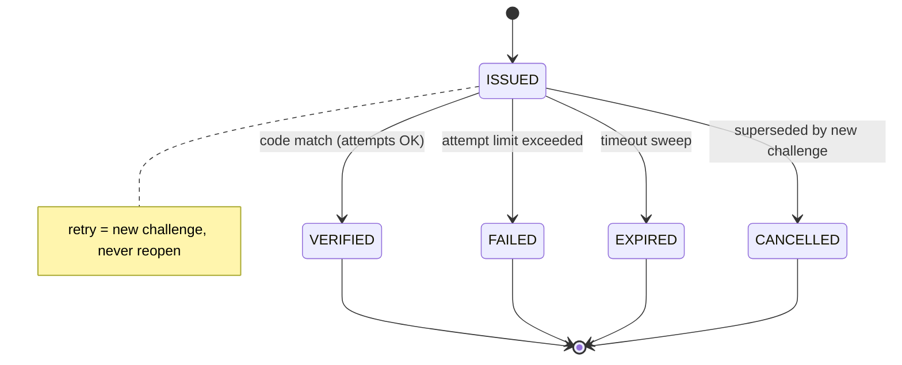
```mermaid
stateDiagram-v2
  [*] --> ISSUED
  ISSUED --> VERIFIED: code match (attempts OK)
  ISSUED --> FAILED: attempt limit exceeded
  ISSUED --> EXPIRED: timeout sweep
  ISSUED --> CANCELLED: superseded by new challenge
  VERIFIED --> [*]
  FAILED --> [*]
  EXPIRED --> [*]
  CANCELLED --> [*]
  note right of ISSUED: retry = new challenge, never reopen
```

## 2. Secure Access Grant (LC-03)

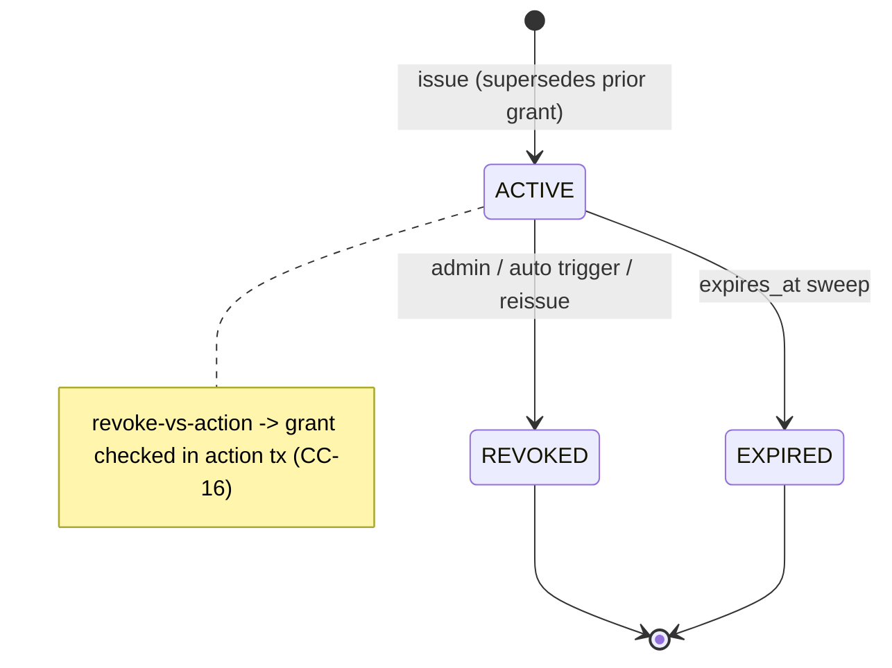
```mermaid
stateDiagram-v2
  [*] --> ACTIVE: issue (supersedes prior grant)
  ACTIVE --> REVOKED: admin / auto trigger / reissue
  ACTIVE --> EXPIRED: expires_at sweep
  REVOKED --> [*]
  EXPIRED --> [*]
  note right of ACTIVE: revoke-vs-action -> grant checked in action tx (CC-16)
```

## 3. Design Session (LC-07)

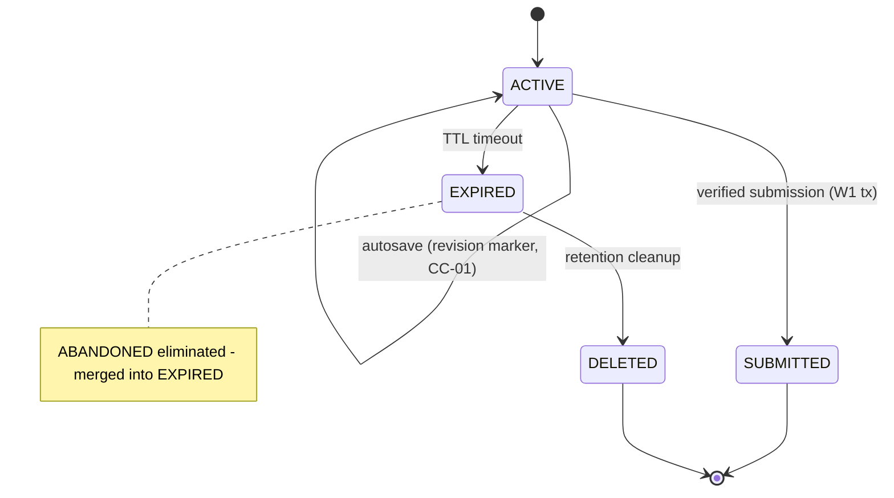
```mermaid
stateDiagram-v2
  [*] --> ACTIVE
  ACTIVE --> ACTIVE: autosave (revision marker, CC-01)
  ACTIVE --> SUBMITTED: verified submission (W1 tx)
  ACTIVE --> EXPIRED: TTL timeout
  EXPIRED --> DELETED: retention cleanup
  SUBMITTED --> [*]
  DELETED --> [*]
  note right of EXPIRED: ABANDONED eliminated - merged into EXPIRED
```

## 4. Design Version (LC-08)

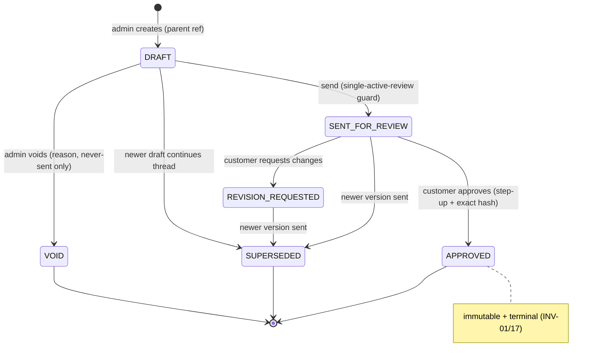
```mermaid
stateDiagram-v2
  [*] --> DRAFT: admin creates (parent ref)
  DRAFT --> SENT_FOR_REVIEW: send (single-active-review guard)
  SENT_FOR_REVIEW --> REVISION_REQUESTED: customer requests changes
  SENT_FOR_REVIEW --> APPROVED: customer approves (step-up + exact hash)
  SENT_FOR_REVIEW --> SUPERSEDED: newer version sent
  REVISION_REQUESTED --> SUPERSEDED: newer version sent
  DRAFT --> SUPERSEDED: newer draft continues thread
  DRAFT --> VOID: admin voids (reason, never-sent only)
  APPROVED --> [*]
  SUPERSEDED --> [*]
  VOID --> [*]
  note right of APPROVED: immutable + terminal (INV-01/17)
```

## 5. Customer Review (LC-09 — decision records)

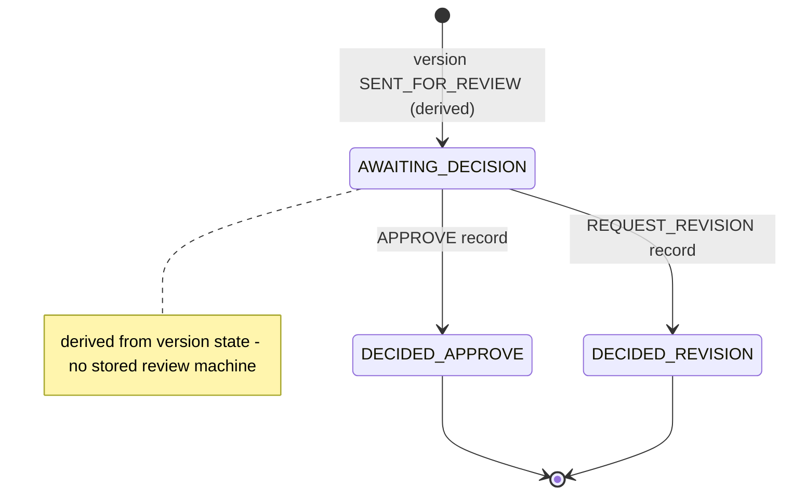
```mermaid
stateDiagram-v2
  [*] --> AWAITING_DECISION: version SENT_FOR_REVIEW (derived)
  AWAITING_DECISION --> DECIDED_APPROVE: APPROVE record
  AWAITING_DECISION --> DECIDED_REVISION: REQUEST_REVISION record
  DECIDED_APPROVE --> [*]
  DECIDED_REVISION --> [*]
  note right of AWAITING_DECISION: derived from version state - no stored review machine
```

## 6. Custom Request (LC-11)

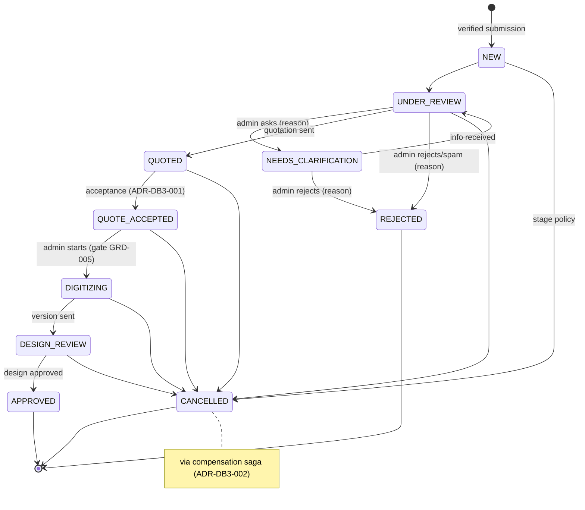
```mermaid
stateDiagram-v2
  [*] --> NEW: verified submission
  NEW --> UNDER_REVIEW
  UNDER_REVIEW --> NEEDS_CLARIFICATION: admin asks (reason)
  NEEDS_CLARIFICATION --> UNDER_REVIEW: info received
  UNDER_REVIEW --> QUOTED: quotation sent
  QUOTED --> QUOTE_ACCEPTED: acceptance (ADR-DB3-001)
  QUOTE_ACCEPTED --> DIGITIZING: admin starts (gate GRD-005)
  DIGITIZING --> DESIGN_REVIEW: version sent
  DESIGN_REVIEW --> APPROVED: design approved
  UNDER_REVIEW --> REJECTED: admin rejects/spam (reason)
  NEEDS_CLARIFICATION --> REJECTED: admin rejects (reason)
  NEW --> CANCELLED: stage policy
  UNDER_REVIEW --> CANCELLED
  QUOTED --> CANCELLED
  QUOTE_ACCEPTED --> CANCELLED
  DIGITIZING --> CANCELLED
  DESIGN_REVIEW --> CANCELLED
  APPROVED --> [*]
  REJECTED --> [*]
  CANCELLED --> [*]
  note right of CANCELLED: via compensation saga (ADR-DB3-002)
```

## 7. Quotation — header + version (LC-12/LC-13)

```mermaid
stateDiagram-v2
  state "Header" as H {
    [*] --> H_DRAFT
    H_DRAFT --> H_SENT: version frozen+sent
    H_SENT --> H_ACCEPTED: current version accepted
    H_SENT --> H_EXPIRED: validity passed
    H_SENT --> H_REJECTED: customer rejects
    H_EXPIRED --> H_SENT: new version sent
    H_ACCEPTED --> H_SENT: re-acceptance round (price change)
    H_SENT --> H_CANCELLED: saga
    H_ACCEPTED --> H_CANCELLED: saga
  }
  note right of H: version states: DRAFT/SENT/ACCEPTED/SUPERSEDED/EXPIRED/REJECTED/VOID - sent versions immutable (INV-02); REVISED eliminated -> SUPERSEDED
```

## 8. Order (LC-14)

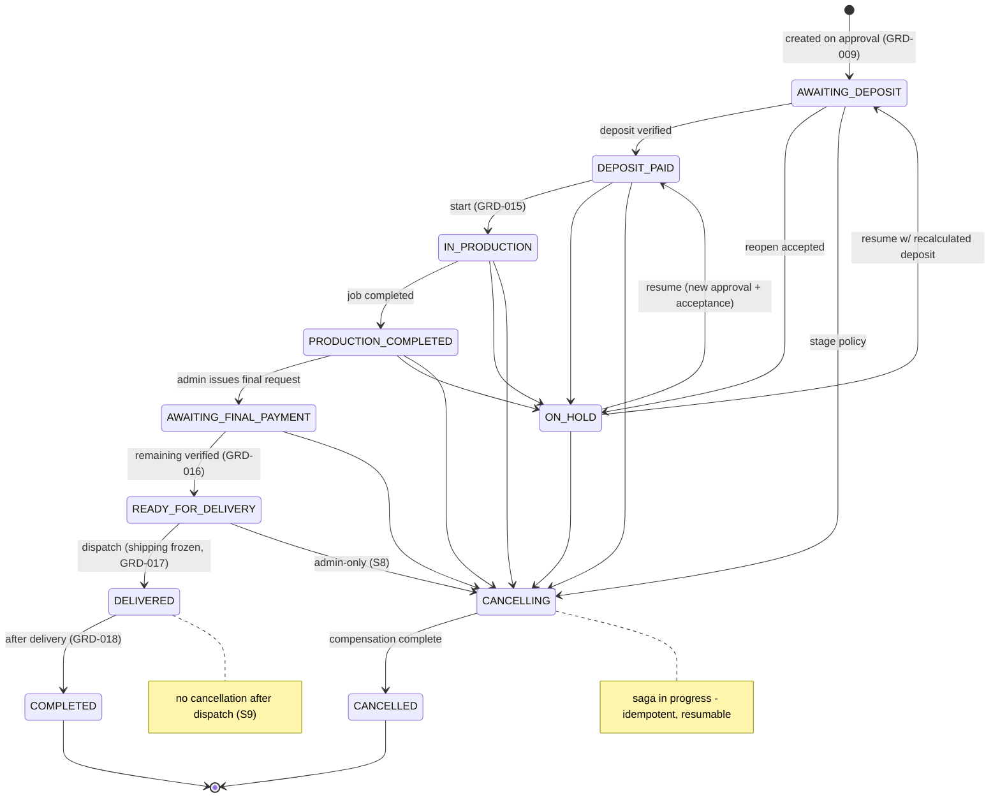
```mermaid
stateDiagram-v2
  [*] --> AWAITING_DEPOSIT: created on approval (GRD-009)
  AWAITING_DEPOSIT --> DEPOSIT_PAID: deposit verified
  DEPOSIT_PAID --> IN_PRODUCTION: start (GRD-015)
  IN_PRODUCTION --> PRODUCTION_COMPLETED: job completed
  PRODUCTION_COMPLETED --> AWAITING_FINAL_PAYMENT: admin issues final request
  AWAITING_FINAL_PAYMENT --> READY_FOR_DELIVERY: remaining verified (GRD-016)
  READY_FOR_DELIVERY --> DELIVERED: dispatch (shipping frozen, GRD-017)
  DELIVERED --> COMPLETED: after delivery (GRD-018)
  AWAITING_DEPOSIT --> ON_HOLD: reopen accepted
  DEPOSIT_PAID --> ON_HOLD
  IN_PRODUCTION --> ON_HOLD
  PRODUCTION_COMPLETED --> ON_HOLD
  ON_HOLD --> DEPOSIT_PAID: resume (new approval + acceptance)
  ON_HOLD --> AWAITING_DEPOSIT: resume w/ recalculated deposit
  AWAITING_DEPOSIT --> CANCELLING: stage policy
  DEPOSIT_PAID --> CANCELLING
  IN_PRODUCTION --> CANCELLING
  PRODUCTION_COMPLETED --> CANCELLING
  AWAITING_FINAL_PAYMENT --> CANCELLING
  READY_FOR_DELIVERY --> CANCELLING: admin-only (S8)
  ON_HOLD --> CANCELLING
  CANCELLING --> CANCELLED: compensation complete
  COMPLETED --> [*]
  CANCELLED --> [*]
  note right of CANCELLING: saga in progress - idempotent, resumable
  note right of DELIVERED: no cancellation after dispatch (S9)
```

## 9. Payment Obligation (LC-15)

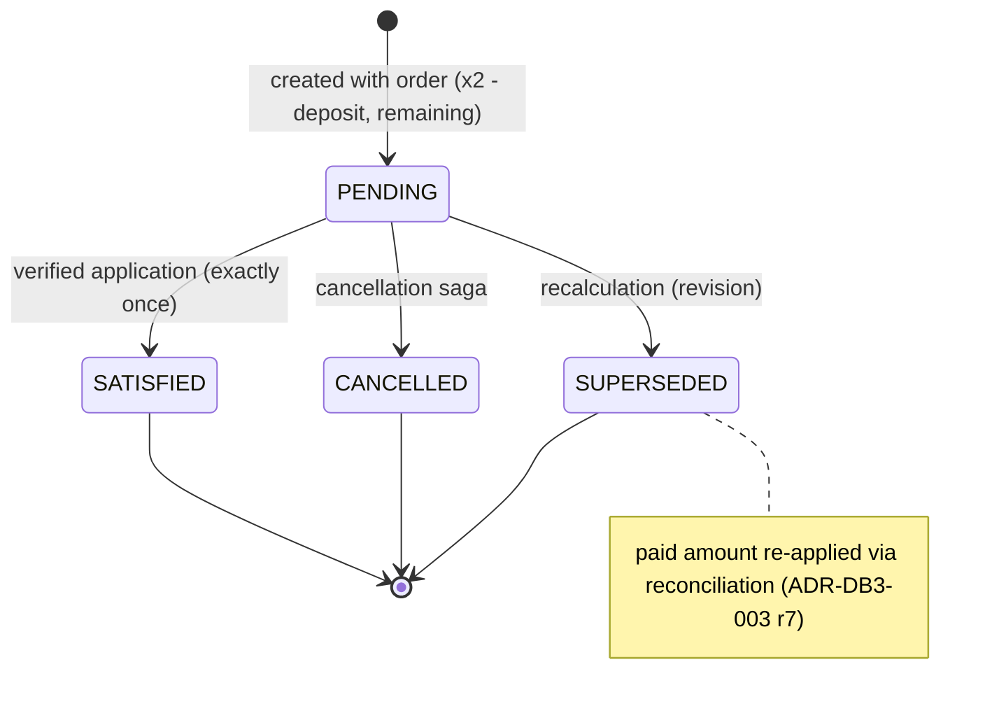
```mermaid
stateDiagram-v2
  [*] --> PENDING: created with order (x2 - deposit, remaining)
  PENDING --> SATISFIED: verified application (exactly once)
  PENDING --> CANCELLED: cancellation saga
  PENDING --> SUPERSEDED: recalculation (revision)
  SATISFIED --> [*]
  CANCELLED --> [*]
  SUPERSEDED --> [*]
  note right of SUPERSEDED: paid amount re-applied via reconciliation (ADR-DB3-003 r7)
```

## 10. Payment Attempt (LC-16)

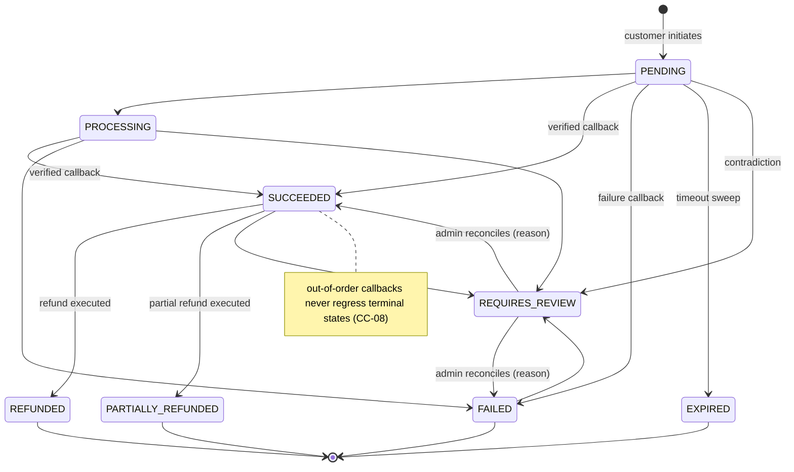
```mermaid
stateDiagram-v2
  [*] --> PENDING: customer initiates
  PENDING --> PROCESSING
  PENDING --> SUCCEEDED: verified callback
  PROCESSING --> SUCCEEDED: verified callback
  PENDING --> FAILED: failure callback
  PROCESSING --> FAILED
  PENDING --> EXPIRED: timeout sweep
  SUCCEEDED --> REFUNDED: refund executed
  SUCCEEDED --> PARTIALLY_REFUNDED: partial refund executed
  PENDING --> REQUIRES_REVIEW: contradiction
  PROCESSING --> REQUIRES_REVIEW
  SUCCEEDED --> REQUIRES_REVIEW
  FAILED --> REQUIRES_REVIEW
  REQUIRES_REVIEW --> SUCCEEDED: admin reconciles (reason)
  REQUIRES_REVIEW --> FAILED: admin reconciles (reason)
  REFUNDED --> [*]
  PARTIALLY_REFUNDED --> [*]
  FAILED --> [*]
  EXPIRED --> [*]
  note right of SUCCEEDED: out-of-order callbacks never regress terminal states (CC-08)
```

## 11. Inventory — Soft Hold & Official Reservation (LC-17)

```mermaid
stateDiagram-v2
  state "Soft Hold" as SH {
    [*] --> HELD
    HELD --> CONVERTED: official reservation created
    HELD --> RELEASED: admin (reason)
    HELD --> EXPIRED: TTL sweep
    CONVERTED --> [*]
    RELEASED --> [*]
    EXPIRED --> [*]
  }
  state "Official Reservation" as OR {
    [*] --> RESERVED: deposit verified (GRD-013/014)
    RESERVED --> CONSUMED: production goods issue
    RESERVED --> RELEASED_R: cancellation/admin (reason)
    RESERVED --> EXPIRED_R: explicit expiry sweep (if configured)
    CONSUMED --> [*]
    RELEASED_R --> [*]
    EXPIRED_R --> [*]
  }
  note right of OR: all transitions idempotent; never negative stock (INV-18)
```

## 12. Production Job (LC-18)

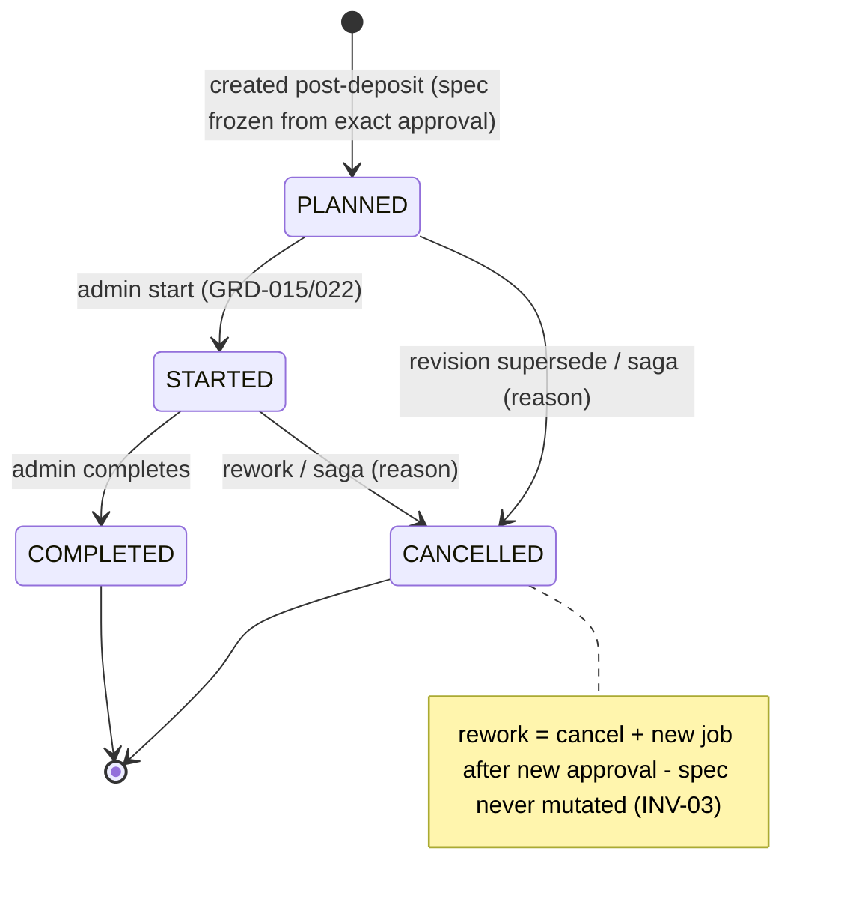
```mermaid
stateDiagram-v2
  [*] --> PLANNED: created post-deposit (spec frozen from exact approval)
  PLANNED --> STARTED: admin start (GRD-015/022)
  STARTED --> COMPLETED: admin completes
  PLANNED --> CANCELLED: revision supersede / saga (reason)
  STARTED --> CANCELLED: rework / saga (reason)
  COMPLETED --> [*]
  CANCELLED --> [*]
  note right of CANCELLED: rework = cancel + new job after new approval - spec never mutated (INV-03)
```

## 13. Shipping / Delivery (LC-19 — order-embedded)

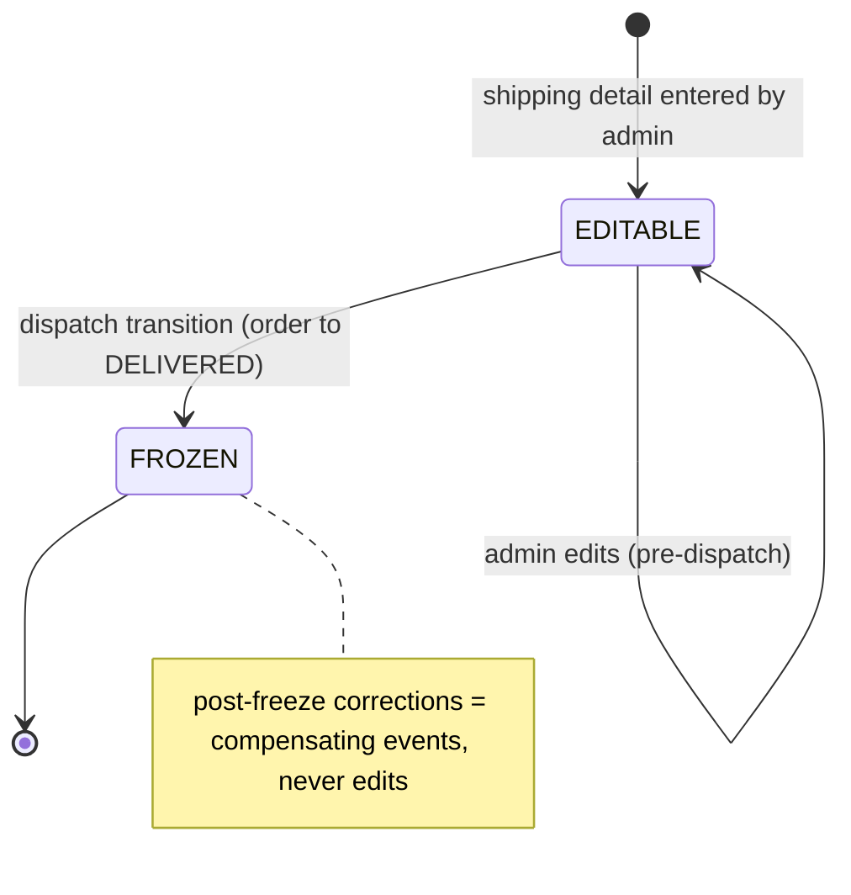
```mermaid
stateDiagram-v2
  [*] --> EDITABLE: shipping detail entered by admin
  EDITABLE --> EDITABLE: admin edits (pre-dispatch)
  EDITABLE --> FROZEN: dispatch transition (order to DELIVERED)
  FROZEN --> [*]
  note right of FROZEN: post-freeze corrections = compensating events, never edits
```

## 14. Cancellation / Refund orchestration (LC-21 + LC-20)

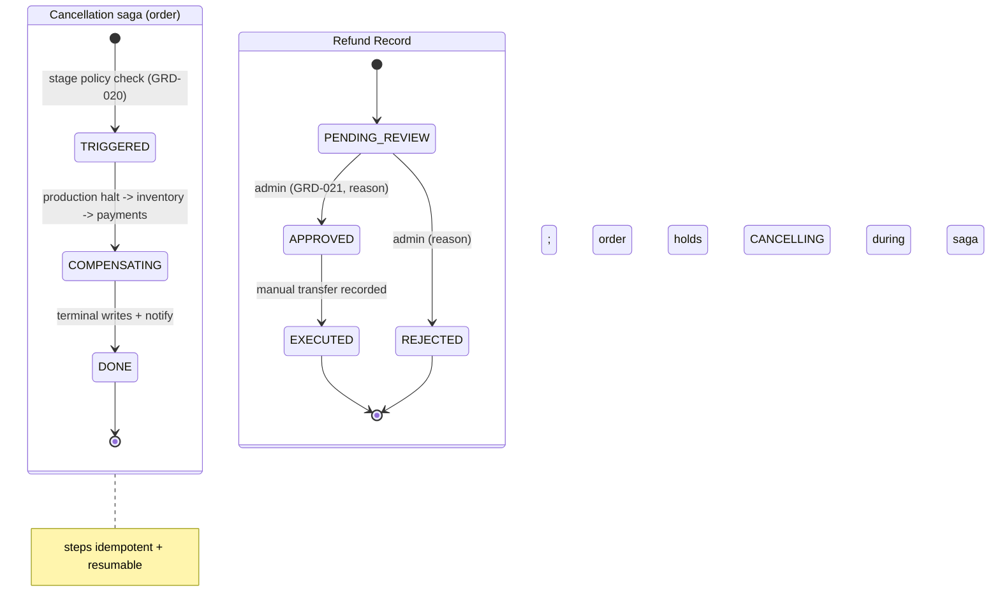
```mermaid
stateDiagram-v2
  state "Cancellation saga (order)" as S {
    [*] --> TRIGGERED: stage policy check (GRD-020)
    TRIGGERED --> COMPENSATING: production halt -> inventory -> payments
    COMPENSATING --> DONE: terminal writes + notify
    DONE --> [*]
  }
  state "Refund Record" as R {
    [*] --> PENDING_REVIEW
    PENDING_REVIEW --> APPROVED: admin (GRD-021, reason)
    PENDING_REVIEW --> REJECTED: admin (reason)
    APPROVED --> EXECUTED: manual transfer recorded
    EXECUTED --> [*]
    REJECTED --> [*]
  }
  note right of S: steps idempotent + resumable; order holds CANCELLING during saga
```

## 15. Outbox Event (LC-22)

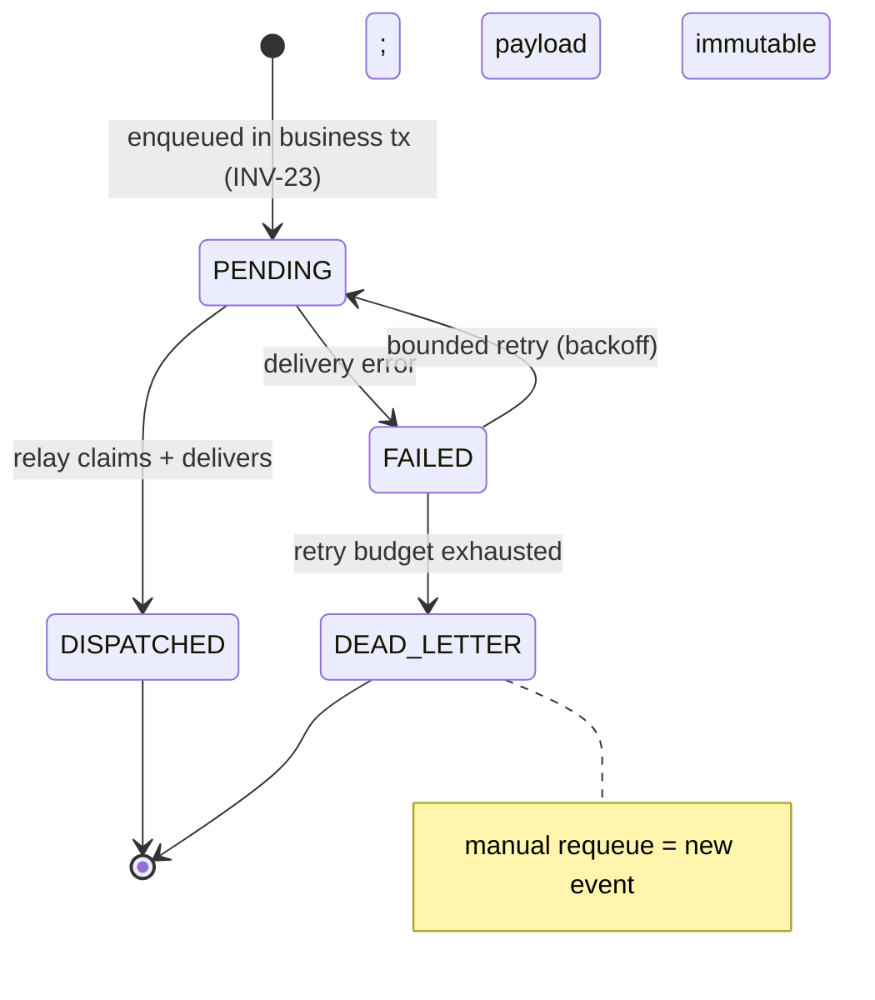
```mermaid
stateDiagram-v2
  [*] --> PENDING: enqueued in business tx (INV-23)
  PENDING --> DISPATCHED: relay claims + delivers
  PENDING --> FAILED: delivery error
  FAILED --> PENDING: bounded retry (backoff)
  FAILED --> DEAD_LETTER: retry budget exhausted
  DISPATCHED --> [*]
  DEAD_LETTER --> [*]
  note right of DEAD_LETTER: manual requeue = new event; payload immutable
```

## 16. Idempotency Record (LC-23)

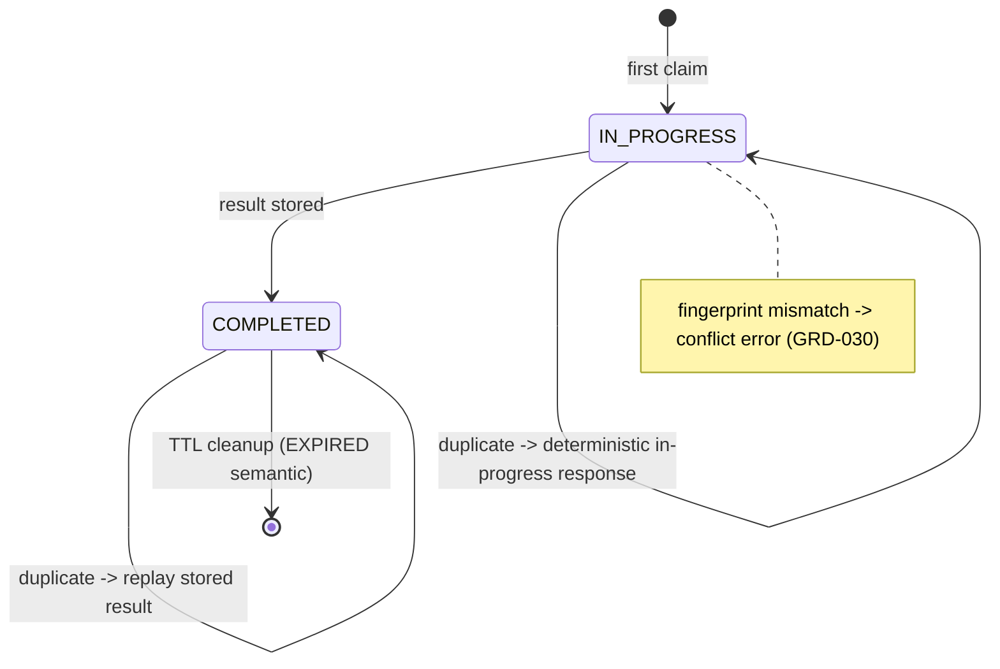
```mermaid
stateDiagram-v2
  [*] --> IN_PROGRESS: first claim
  IN_PROGRESS --> COMPLETED: result stored
  IN_PROGRESS --> IN_PROGRESS: duplicate -> deterministic in-progress response
  COMPLETED --> COMPLETED: duplicate -> replay stored result
  COMPLETED --> [*]: TTL cleanup (EXPIRED semantic)
  note right of IN_PROGRESS: fingerprint mismatch -> conflict error (GRD-030)
```

## 17. Notification Intent / Delivery Attempt

```mermaid
stateDiagram-v2
  [*] --> PENDING: intent created from outbox event (intent key dedup)
  PENDING --> PROCESSING: worker picks up
  PROCESSING --> SATISFIED: attempt DELIVERED
  PROCESSING --> PENDING: FAILED_RETRYABLE (bounded)
  PROCESSING --> FAILED: FAILED_TERMINAL / retries exhausted
  PENDING --> CANCELLED: source voided
  SATISFIED --> [*]
  FAILED --> [*]
  CANCELLED --> [*]
  note right of FAILED: dead-letter visible + audited; attempts are append-only records
```

## 18. Agreement Version

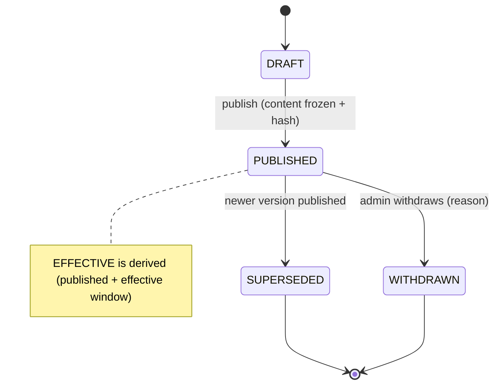
```mermaid
stateDiagram-v2
  [*] --> DRAFT
  DRAFT --> PUBLISHED: publish (content frozen + hash)
  PUBLISHED --> SUPERSEDED: newer version published
  PUBLISHED --> WITHDRAWN: admin withdraws (reason)
  SUPERSEDED --> [*]
  WITHDRAWN --> [*]
  note right of PUBLISHED: EFFECTIVE is derived (published + effective window)
```

## 19. Admin Account / Session (LC-01)

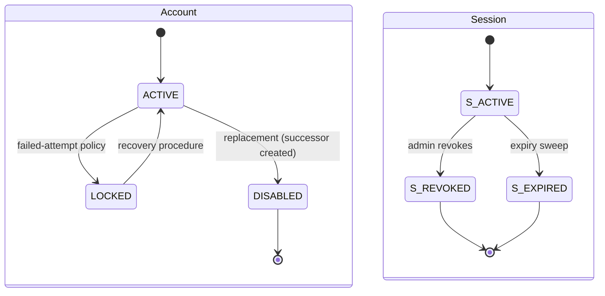
```mermaid
stateDiagram-v2
  state "Account" as A {
    [*] --> ACTIVE
    ACTIVE --> LOCKED: failed-attempt policy
    LOCKED --> ACTIVE: recovery procedure
    ACTIVE --> DISABLED: replacement (successor created)
    DISABLED --> [*]
  }
  state "Session" as SS {
    [*] --> S_ACTIVE
    S_ACTIVE --> S_REVOKED: admin revokes
    S_ACTIVE --> S_EXPIRED: expiry sweep
    S_REVOKED --> [*]
    S_EXPIRED --> [*]
  }
```
