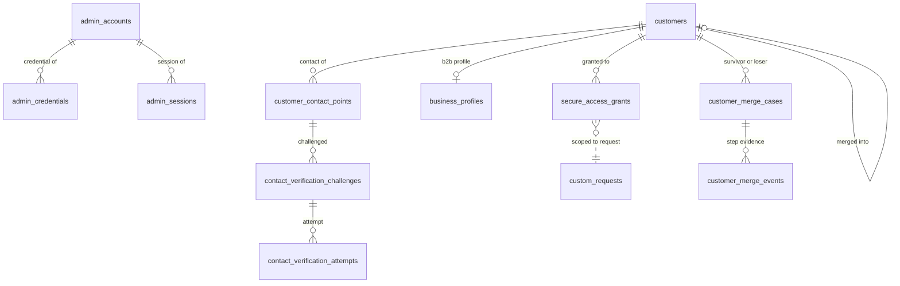
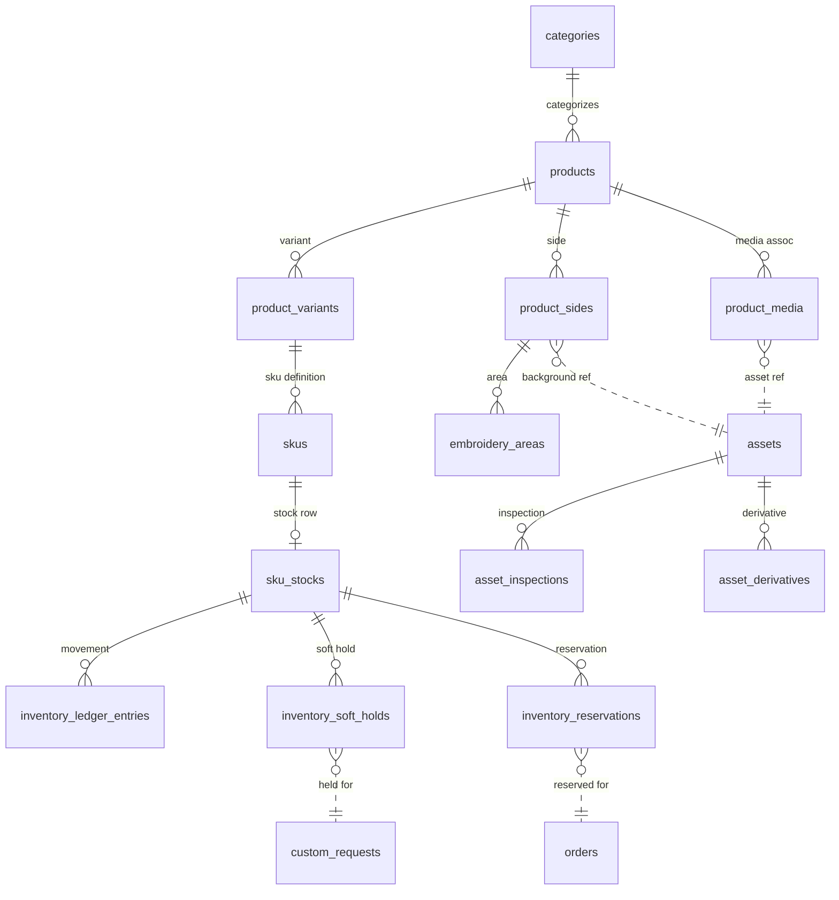
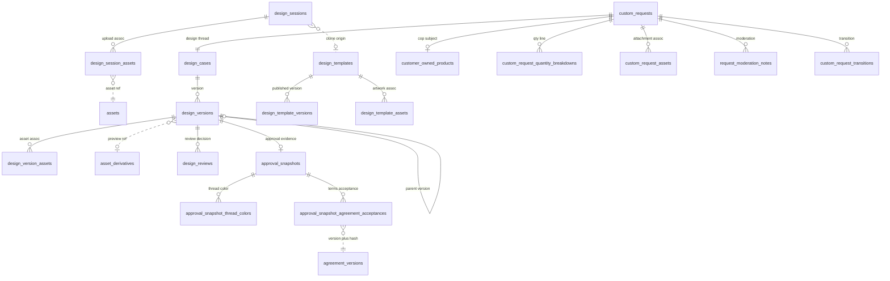
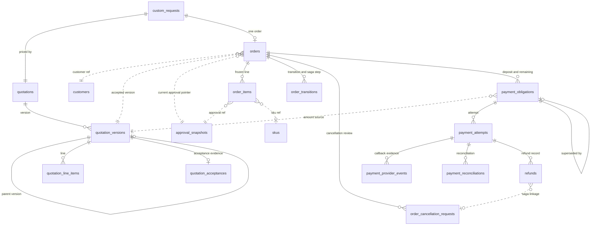
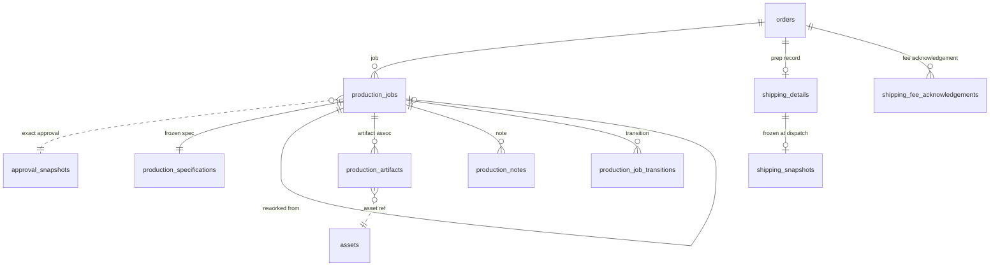
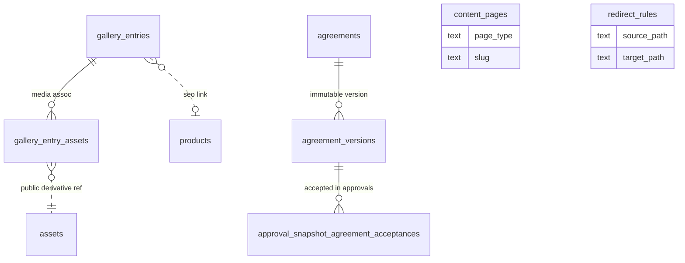
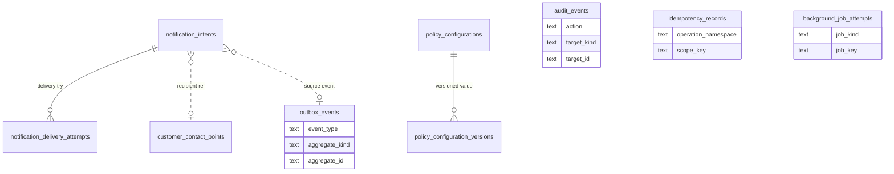

# DB4 — Logical Relational Diagrams

**Date:** 2026-07-15 · **Git HEAD:** `a79f523`
**Nature:** Mermaid ER diagrams at logical level — table names, key
reference labels, cardinality. No SQL/index/Drizzle/migration syntax.
Cardinality: `||` one · `o|` zero-or-one · `o{` zero-or-many · `|{`
one-or-many. Dashed (`..`) = cross-context identity/snapshot reference.

## 1. Identity & Customer

## 2. Catalog, Inventory & Asset

## 3. Design, Request & Approval

## 4. Quotation, Order & Payment

## 5. Production & Shipping

## 6. Content, Gallery & Agreement

## 7. Notification, Audit & Platform

Note: standalone entities in §6/§7 carry no intra-diagram relationship
lines because their targets are justified polymorphic references without
physical FKs (audit target, outbox aggregate ref — REL-103/104).
